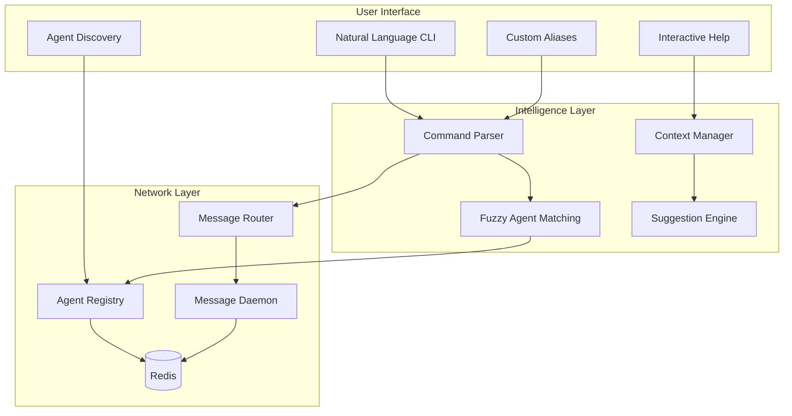
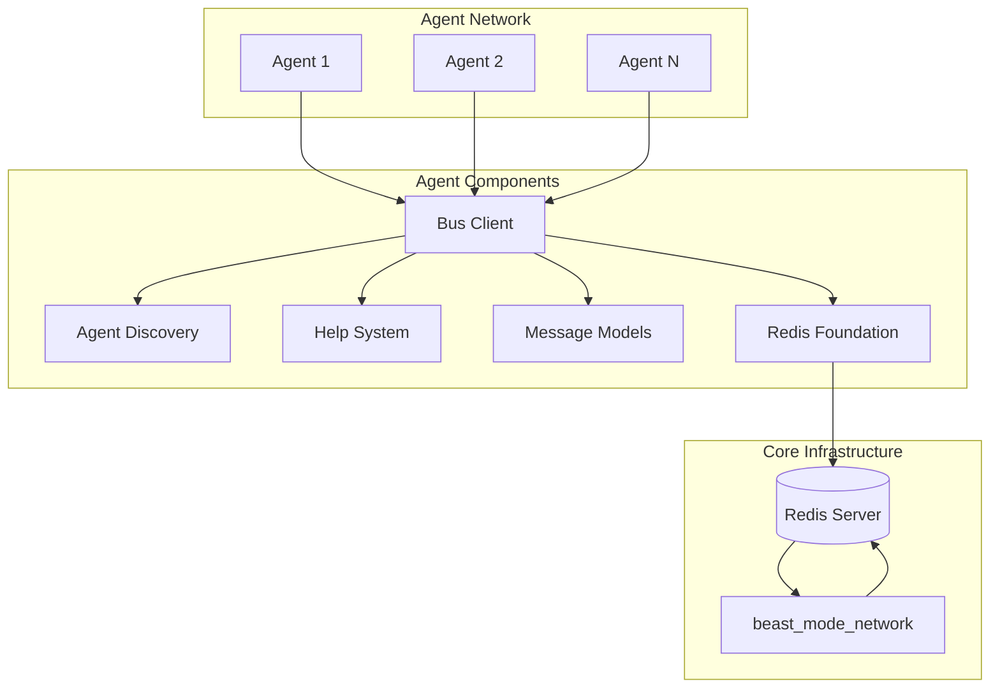
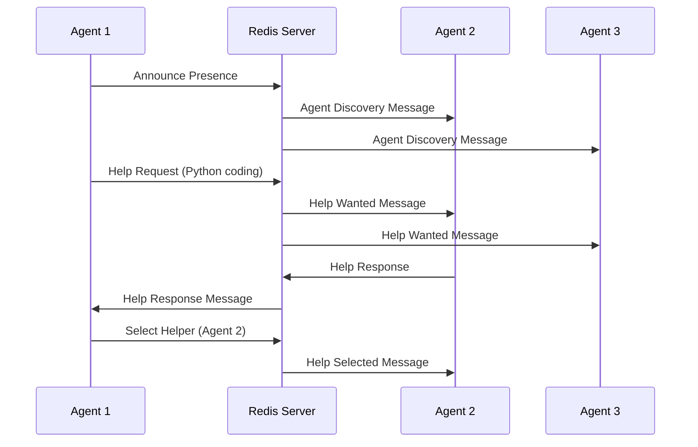
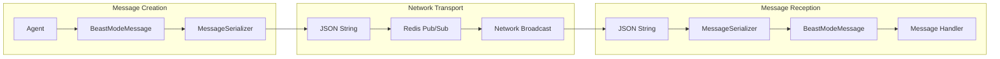
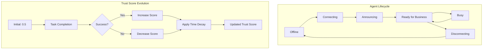
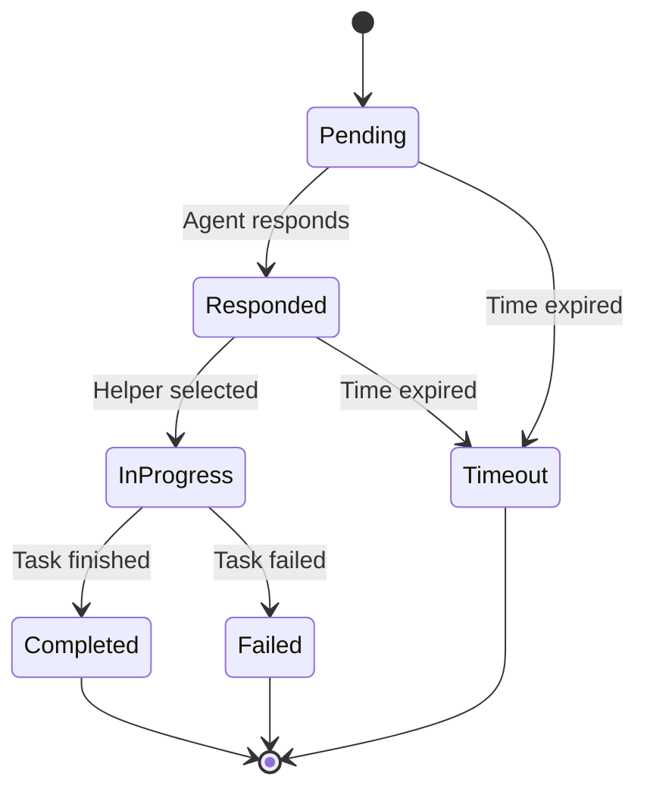

# Design Document

## Overview

The Beast Mode Agent Collaboration Network is designed around one core principle: **it should be as easy as sending a text message**. Users should be able to say "post a message on the beastmaster network" and it just works, without needing to understand Redis, pub/sub, or technical details.

The system provides a natural language interface over a robust distributed messaging infrastructure. Users interact through simple commands, fuzzy agent addressing, and self-discovering functionality, while the underlying system handles all the complexity of agent discovery, message routing, and network coordination.

## User Experience Design

### Dead Simple Messaging

The primary interface is conversational and forgiving:

```bash
# Natural language commands
beast post "Task completed successfully"
beast send "Need help with Python" to "coding expert"
beast ask "Who can help with databases?"

# Fuzzy addressing - system figures out who you mean
beast tell "left-handed stinky flake" "Your spore is ready"
beast broadcast "Looking for TiDB experts"

# Streaming friendly
echo "Status update" | beast post -
beast listen | grep "help_wanted" | beast respond -
```

### Self-Discovery and Help

The system explains itself as you use it:

```bash
# First time usage
$ beast
Welcome to Beast Mode Network! 
Available agents: kiro_agent, database_expert, python_helper
Try: beast post "Hello network!"

# Contextual help
$ beast send "message" to "nonexistent"
Agent 'nonexistent' not found. Did you mean:
  - database_expert (has database capabilities)  
  - python_helper (active 2 minutes ago)
Or: beast wait-for "nonexistent" "message"

# Discovery mode
$ beast discover
🔍 Discovery Mode: I'll explain everything as we go...
Found 3 active agents:
  - kiro_agent: [collaboration, task_execution] - "Ready for anything!"
  - database_expert: [sql, tidb, analytics] - "TiDB specialist here"
  - python_helper: [python, debugging, code_review] - "Python problems solved"

Try: beast ask "Who can help with [your task]?"
```

### Hot Rod Extensibility

Power users can extend the system and share improvements:

```bash
# Create custom aliases
beast alias "deploy" "post 'Deployment started' && notify ops-team"
beast alias "help-python" "ask 'Need Python help' --capability python"

# Package and share
beast package my-workflow --description "DevOps deployment pattern"
beast share my-workflow --to factory

# Install community extensions  
beast install tidb-helpers --from factory
beast install debugging-toolkit --from community
```

## Architecture

### User Experience Layer



### System Architecture



### Message Flow Architecture



## Components and Interfaces

### 1. Natural Language Command Parser

**Design Philosophy:** Accept any reasonable way a user might express their intent.

```python
class CommandParser:
    """Parses natural language commands into system actions."""
    
    def parse_command(self, user_input: str) -> Command:
        """
        Examples of accepted input:
        - "post a message on the beastmaster network"
        - "send 'hello' to python expert"  
        - "tell left-handed stinky flake the spore is ready"
        - "ask who can help with databases"
        - "broadcast looking for TiDB help"
        """
        
    def resolve_agent_reference(self, reference: str) -> List[AgentMatch]:
        """
        Fuzzy matching for agent references:
        - Exact ID match
        - Nickname/alias match  
        - Capability-based match
        - Description keyword match
        - Phonetic similarity
        """
        
    def suggest_corrections(self, failed_command: str) -> List[Suggestion]:
        """Provide helpful suggestions when commands fail."""
```

### 2. Interactive Help System

```python
class HelpSystem:
    """Context-aware help that teaches as you use the system."""
    
    def provide_contextual_help(self, command: str, context: Dict) -> HelpResponse:
        """
        Provides help based on:
        - What the user was trying to do
        - Current network state
        - User's experience level
        - Available agents and capabilities
        """
        
    def discovery_mode(self) -> InteractiveSession:
        """Guided exploration of network capabilities."""
        
    def troubleshoot(self, error: Exception, context: Dict) -> TroubleshootingGuide:
        """Convert errors into actionable guidance."""
```

### 3. Message Models (`message_models.py`)

**Core Data Structures:**

```python
class MessageType(str, Enum):
    SIMPLE_MESSAGE = "simple_message"
    PROMPT_REQUEST = "prompt_request"
    PROMPT_RESPONSE = "prompt_response"
    AGENT_DISCOVERY = "agent_discovery"
    AGENT_RESPONSE = "agent_response"
    HELP_WANTED = "help_wanted"
    HELP_RESPONSE = "help_response"
    SPORE_DELIVERY = "spore_delivery"
    SPORE_REQUEST = "spore_request"
    TECHNICAL_EXCHANGE = "technical_exchange"
    SYSTEM_HEALTH = "system_health"
    PROCESSOR_RESPONSE = "processor_response"

@dataclass
class BeastModeMessage:
    type: MessageType
    source: str
    target: Optional[str] = None
    payload: Dict[str, Any] = field(default_factory=dict)
    timestamp: datetime = field(default_factory=datetime.now)
    priority: int = 5
    id: str = field(default_factory=lambda: str(uuid.uuid4()))
```

**Key Features:**
- Structured message format with unique IDs and timestamps
- JSON serialization/deserialization with error handling
- Support for targeted and broadcast messaging
- Priority-based message handling
- Extensible payload system for different message types

### 2. Redis Foundation (`redis_foundation.py`)

**Connection Management:**

```python
class RedisConnectionManager:
    def __init__(self, redis_url: str = "redis://localhost:6379", 
                 max_retries: int = 5, retry_delay: float = 1.0)
    
    async def connect(self) -> bool
    async def disconnect(self)
    async def is_healthy(self) -> bool
    async def publish(self, channel: str, message: str)
    async def get_pubsub()
```

**Key Features:**
- Automatic reconnection with exponential backoff
- Health monitoring and connection state management
- Pub/sub abstraction for message broadcasting
- Error handling and logging for network issues
- Configurable retry policies

### 3. Agent Discovery (`agent_discovery.py`)

**Agent Registry:**

```python
@dataclass
class DiscoveredAgent:
    agent_id: str
    capabilities: List[str]
    specializations: List[str]
    availability: str
    last_seen: datetime
    collaboration_history: List[str]
    trust_score: float = 0.5
    response_count: int = 0
    success_count: int = 0

class AgentRegistry:
    async def register_agent(self, capabilities: AgentCapabilities)
    async def find_agents_by_capabilities(self, required_capabilities: List[str])
    async def get_available_agents(self)
    async def update_agent_trust(self, agent_id: str, success: bool)
```

**Key Features:**
- Capability-based agent indexing for fast lookups
- Trust scoring system with success rate tracking
- Availability monitoring with timeout detection
- Capability matching with scoring algorithms
- Thread-safe registry operations

### 4. Help System (`help_system.py`)

**Help Request Management:**

```python
@dataclass
class HelpRequest:
    request_id: str
    requester_id: str
    required_capabilities: List[str]
    description: str
    status: HelpRequestStatus
    created_at: datetime
    responses: List[str]
    selected_responder: Optional[str]
    timeout_minutes: int = 30

class HelpSystemManager:
    async def request_help(self, required_capabilities: List[str], 
                          description: str, timeout_minutes: int = 30) -> str
    async def get_help_requests(self) -> List[HelpRequest]
    async def get_available_helpers(self, required_capabilities: List[str])
```

**Key Features:**
- Request lifecycle management (pending → responded → in_progress → completed)
- Timeout handling for expired requests
- Response tracking and helper selection
- Integration with agent discovery for capability matching
- Success/failure tracking for trust score updates

### 5. Bus Client (`bus_client.py`)

**Simplified Agent Interface:**

```python
class BeastModeBusClient:
    def __init__(self, redis_url: str, capabilities: List[str], agent_id: str)
    
    async def connect(self) -> bool
    async def announce_presence(self)
    async def send_message(self, message: BeastModeMessage) -> bool
    async def send_simple_message(self, message_text: str, target_agent: str)
    def register_message_handler(self, message_type: MessageType, handler: Callable)
    async def listen_for_messages(self)
```

**Key Features:**
- High-level API for agent integration
- Automatic message routing based on type
- Handler registration system for different message types
- Connection management abstraction
- Presence announcement automation

## Data Models

### Message Data Flow



### Agent State Management



### Help Request State Machine



## Error Handling

### 1. Network Resilience
- **Redis Connection Failures**: Automatic reconnection with exponential backoff
- **Message Delivery Failures**: Logging and graceful degradation
- **Network Partitions**: Agent state recovery on reconnection
- **Timeout Handling**: Configurable timeouts for all operations

### 2. Data Validation
- **Message Deserialization**: JSON parsing error handling with fallback
- **Agent Registration**: Capability validation and sanitization
- **Trust Score Bounds**: Ensure scores remain within 0.0-1.0 range
- **Timestamp Handling**: ISO format parsing with timezone awareness

### 3. Concurrency Safety
- **Registry Updates**: Async locks for thread-safe agent registration
- **Message Handlers**: Exception isolation to prevent handler failures from affecting others
- **Connection Management**: Thread-safe Redis connection pooling
- **State Transitions**: Atomic updates for help request status changes

## Testing Strategy

### 1. Unit Tests
- **Message Serialization**: Test JSON conversion and data integrity
- **Trust Score Calculations**: Verify scoring algorithms and edge cases
- **Capability Matching**: Test agent discovery filtering and ranking
- **Connection Management**: Mock Redis for connection testing

### 2. Integration Tests
- **Multi-Agent Scenarios**: Test agent discovery and communication
- **Help Request Workflows**: End-to-end help request lifecycle
- **Network Resilience**: Redis failure and recovery scenarios
- **Message Routing**: Verify message delivery and handler execution

### 3. Performance Tests
- **Message Throughput**: Test system performance under high message volume
- **Agent Discovery**: Performance with large numbers of registered agents
- **Memory Usage**: Monitor memory consumption during long-running operations
- **Connection Scaling**: Test Redis connection limits and pooling

### 4. System Tests
- **Auto Setup Verification**: Test complete system deployment from spore
- **Cross-Platform Compatibility**: Test on different operating systems
- **Redis Configuration**: Test with different Redis configurations
- **Agent Lifecycle**: Test complete agent join/leave/rejoin scenarios

## Implementation Strategy

### Phase 1: Core Infrastructure
1. Implement message models with serialization
2. Create Redis connection management with retry logic
3. Build basic pub/sub messaging system
4. Add comprehensive error handling and logging

### Phase 2: Agent Discovery
1. Implement agent registry with capability indexing
2. Add trust scoring system with success tracking
3. Create capability matching algorithms
4. Build availability monitoring system

### Phase 3: Help System
1. Implement help request lifecycle management
2. Add timeout handling and request expiration
3. Create helper selection and response tracking
4. Integrate with agent discovery for capability matching

### Phase 4: Bus Client Integration
1. Create high-level agent API
2. Implement message handler registration system
3. Add automatic presence announcement
4. Build connection management abstraction

### Phase 5: Auto Setup System
1. Implement spore extraction and file generation
2. Create automated agent configuration
3. Add dependency verification and setup
4. Build demonstration and testing capabilities

### Phase 6: Testing and Documentation
1. Comprehensive test suite for all components
2. Performance testing and optimization
3. Documentation and usage examples
4. Integration guides for different agent types