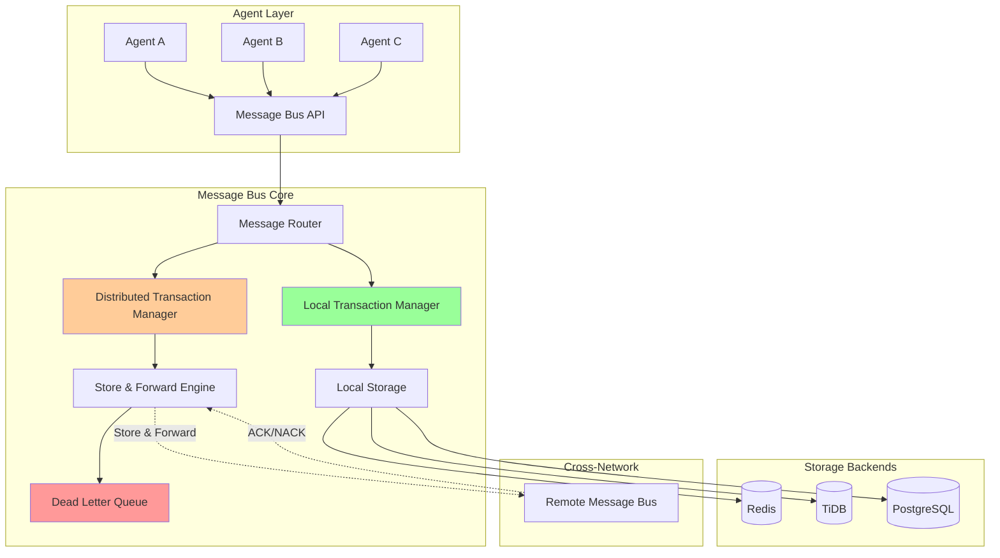
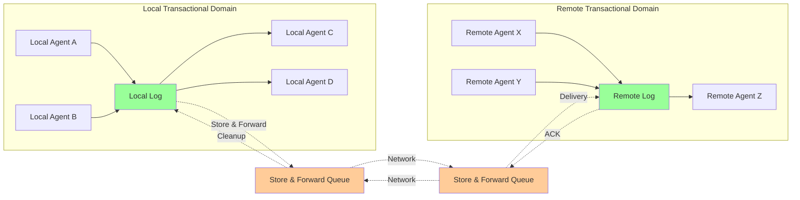
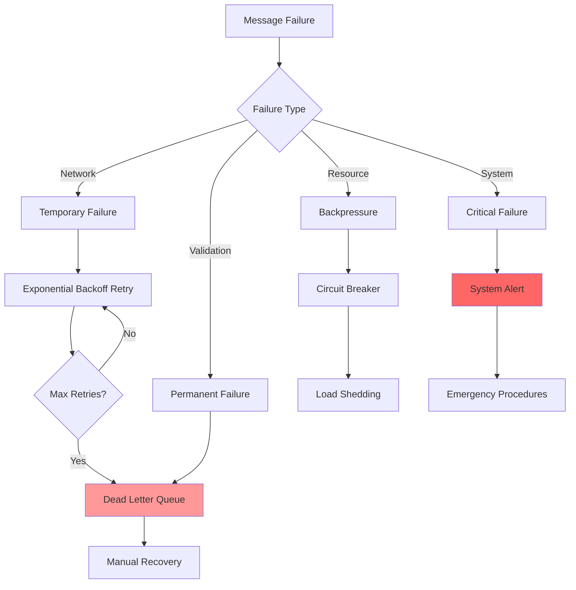

# Distributed Message Bus Design Document

## Overview

The Distributed Message Bus is a horizontally scalable messaging infrastructure that provides transactional coordination for the Beast Mode Network. It bridges local ACID guarantees with distributed store-and-forward patterns, enabling reliable multi-agent workflows across arbitrary network topologies while maintaining developer-friendly APIs.

### Core Design Principles

1. **Physics-Based Architecture**: Embrace the fundamental constraint that transactional messaging requires synchronous logs
2. **Graceful Degradation**: System remains functional even when components fail or become unavailable
3. **Zero Configuration**: Works out-of-the-box for single developers, scales automatically for distributed teams
4. **Backend Agnostic**: Abstract storage layer supports multiple implementations with identical APIs
5. **Observability First**: Every message operation is traceable and queryable for debugging

## Architecture

### High-Level System Architecture



### Transactional Boundary Design



## Components and Interfaces

### Message Bus API Layer

The API layer provides a unified interface that abstracts storage backend complexity:

```python
# Core API Interface
class MessageBus:
    async def send(self, message: Message, target: AgentId = None) -> MessageId
    async def receive(self, agent_id: AgentId) -> AsyncIterator[Message]
    async def subscribe(self, pattern: str, handler: MessageHandler) -> Subscription
    async def transaction(self) -> TransactionContext
    
    # Observability
    async def trace_message(self, message_id: MessageId) -> MessageTrace
    async def query_messages(self, sql: str) -> QueryResult
    
    # Administration
    async def dead_letter_queue(self) -> DeadLetterManager
    async def health_check() -> HealthStatus
```

### Storage Backend Abstraction

```python
# Storage Backend Interface
class StorageBackend:
    async def store_message(self, message: Message) -> MessageId
    async def retrieve_messages(self, agent_id: AgentId) -> List[Message]
    async def acknowledge_message(self, message_id: MessageId) -> bool
    async def begin_transaction(self) -> TransactionId
    async def commit_transaction(self, tx_id: TransactionId) -> bool
    async def rollback_transaction(self, tx_id: TransactionId) -> bool
    
    # Dead Letter Queue Operations
    async def move_to_dlq(self, message_id: MessageId, reason: str) -> bool
    async def query_dlq(self, filters: Dict) -> List[DeadMessage]
    
    # Analytics and Observability
    async def execute_query(self, sql: str) -> QueryResult
    async def get_metrics(self) -> StorageMetrics
```

### Message Router Component

The router handles message delivery within local domains and coordinates cross-domain transfers:

```python
class MessageRouter:
    def __init__(self, local_storage: StorageBackend, 
                 network_topology: NetworkTopology):
        self.local_storage = local_storage
        self.topology = network_topology
        self.store_forward = StoreForwardEngine()
    
    async def route_message(self, message: Message) -> RoutingDecision:
        if self.is_local_target(message.target):
            return await self.route_locally(message)
        else:
            return await self.route_cross_domain(message)
    
    async def route_locally(self, message: Message) -> LocalDelivery:
        # Direct delivery within transactional boundary
        async with self.local_storage.begin_transaction() as tx:
            message_id = await self.local_storage.store_message(message)
            await tx.commit()
            return LocalDelivery(message_id, delivered=True)
    
    async def route_cross_domain(self, message: Message) -> CrossDomainDelivery:
        # Store-and-forward with positive acknowledgment
        return await self.store_forward.enqueue(message)
```

### Store-and-Forward Engine

Handles reliable delivery across network boundaries:

```python
class StoreForwardEngine:
    def __init__(self, storage: StorageBackend, 
                 retry_policy: RetryPolicy):
        self.storage = storage
        self.retry_policy = retry_policy
        self.pending_messages = {}
    
    async def enqueue(self, message: Message) -> CrossDomainDelivery:
        # Store message locally until acknowledged
        sf_message = StoreForwardMessage(
            original=message,
            attempts=0,
            next_retry=datetime.now(),
            max_retries=self.retry_policy.max_retries
        )
        
        message_id = await self.storage.store_message(sf_message)
        self.pending_messages[message_id] = sf_message
        
        # Start async delivery process
        asyncio.create_task(self.deliver_with_retry(message_id))
        
        return CrossDomainDelivery(message_id, status="queued")
    
    async def deliver_with_retry(self, message_id: MessageId):
        sf_message = self.pending_messages[message_id]
        
        while sf_message.attempts < sf_message.max_retries:
            try:
                # Attempt delivery to remote domain
                ack = await self.send_to_remote(sf_message.original)
                if ack.success:
                    # Positive acknowledgment received
                    await self.cleanup_delivered_message(message_id)
                    return
                    
            except NetworkException as e:
                sf_message.attempts += 1
                sf_message.next_retry = self.retry_policy.next_retry_time(
                    sf_message.attempts
                )
                await asyncio.sleep(
                    (sf_message.next_retry - datetime.now()).total_seconds()
                )
        
        # Max retries exceeded - move to dead letter queue
        await self.move_to_dead_letter_queue(message_id, "max_retries_exceeded")
```

## Data Models

### Core Message Structure

```python
@dataclass
class Message:
    id: MessageId
    type: MessageType
    source: AgentId
    target: Optional[AgentId]
    payload: Dict[str, Any]
    timestamp: datetime
    priority: int
    correlation_id: Optional[MessageId]
    
    # Routing metadata
    routing_key: str
    ttl: Optional[timedelta]
    
    # Transactional metadata
    transaction_id: Optional[TransactionId]
    local_sequence: int
    
    def to_json(self) -> str:
        return json.dumps(asdict(self), default=str)
    
    @classmethod
    def from_json(cls, json_str: str) -> 'Message':
        data = json.loads(json_str)
        return cls(**data)
```

### Storage Backend Models

#### TiDB Schema Design

```sql
-- Messages table with auto-sharding
CREATE TABLE messages (
    id VARCHAR(36) PRIMARY KEY,
    type VARCHAR(50) NOT NULL,
    source VARCHAR(100) NOT NULL,
    target VARCHAR(100),
    payload JSON NOT NULL,
    timestamp TIMESTAMP(6) NOT NULL,
    priority INT NOT NULL DEFAULT 5,
    correlation_id VARCHAR(36),
    routing_key VARCHAR(200) NOT NULL,
    ttl BIGINT,
    transaction_id VARCHAR(36),
    local_sequence BIGINT NOT NULL,
    status ENUM('pending', 'delivered', 'failed') DEFAULT 'pending',
    
    -- Indexes for efficient querying
    INDEX idx_target_status (target, status),
    INDEX idx_timestamp (timestamp),
    INDEX idx_routing_key (routing_key),
    INDEX idx_transaction (transaction_id)
) SHARD_ROW_ID_BITS = 4;

-- Dead letter queue with failure analysis
CREATE TABLE dead_letter_queue (
    id VARCHAR(36) PRIMARY KEY,
    original_message_id VARCHAR(36) NOT NULL,
    message_data JSON NOT NULL,
    failure_reason TEXT NOT NULL,
    failure_timestamp TIMESTAMP(6) NOT NULL,
    retry_count INT NOT NULL DEFAULT 0,
    last_error TEXT,
    
    INDEX idx_failure_timestamp (failure_timestamp),
    INDEX idx_original_message (original_message_id)
);

-- Store-and-forward tracking
CREATE TABLE store_forward_queue (
    id VARCHAR(36) PRIMARY KEY,
    message_id VARCHAR(36) NOT NULL,
    target_domain VARCHAR(100) NOT NULL,
    attempts INT NOT NULL DEFAULT 0,
    next_retry TIMESTAMP(6) NOT NULL,
    max_retries INT NOT NULL DEFAULT 10,
    status ENUM('pending', 'delivered', 'failed') DEFAULT 'pending',
    
    INDEX idx_next_retry (next_retry, status),
    INDEX idx_target_domain (target_domain)
);
```

#### Redis Data Structures

```python
# Redis key patterns for different data types
class RedisKeyPatterns:
    # Message queues per agent
    AGENT_QUEUE = "agent:{agent_id}:messages"
    
    # Global message storage
    MESSAGE_DATA = "message:{message_id}"
    
    # Transaction coordination
    TRANSACTION = "tx:{transaction_id}"
    TRANSACTION_MESSAGES = "tx:{transaction_id}:messages"
    
    # Store-and-forward queues
    STORE_FORWARD = "sf:{target_domain}"
    PENDING_ACKS = "sf:pending:{message_id}"
    
    # Dead letter queue
    DEAD_LETTER = "dlq:messages"
    DLQ_METADATA = "dlq:{message_id}:meta"
    
    # Analytics and metrics
    METRICS = "metrics:{timestamp}"
    MESSAGE_TRACE = "trace:{message_id}"
```

## Error Handling

### Failure Classification and Recovery



### Dead Letter Queue Management

```python
class DeadLetterManager:
    def __init__(self, storage: StorageBackend):
        self.storage = storage
    
    async def process_dead_letters(self, 
                                 batch_size: int = 100) -> ProcessingResult:
        """Process dead letter queue with recovery options."""
        
        dead_messages = await self.storage.query_dlq({
            'limit': batch_size,
            'order_by': 'failure_timestamp'
        })
        
        results = ProcessingResult()
        
        for dead_msg in dead_messages:
            try:
                recovery_action = await self.analyze_failure(dead_msg)
                
                if recovery_action == RecoveryAction.RETRY:
                    await self.retry_message(dead_msg)
                    results.retried += 1
                    
                elif recovery_action == RecoveryAction.REDIRECT:
                    await self.redirect_message(dead_msg)
                    results.redirected += 1
                    
                elif recovery_action == RecoveryAction.DISCARD:
                    await self.discard_message(dead_msg)
                    results.discarded += 1
                    
            except Exception as e:
                results.errors.append((dead_msg.id, str(e)))
        
        return results
    
    async def analyze_failure(self, dead_msg: DeadMessage) -> RecoveryAction:
        """Analyze failure patterns to determine recovery strategy."""
        
        # Check if target agent is now available
        if dead_msg.failure_reason == "target_unavailable":
            if await self.is_agent_available(dead_msg.original.target):
                return RecoveryAction.RETRY
        
        # Check for transient network issues
        if "network" in dead_msg.failure_reason.lower():
            if dead_msg.retry_count < 3:
                return RecoveryAction.RETRY
        
        # Check for message format issues
        if "validation" in dead_msg.failure_reason.lower():
            return RecoveryAction.DISCARD
        
        # Default to manual review
        return RecoveryAction.MANUAL_REVIEW
```

### Circuit Breaker Pattern

```python
class CircuitBreaker:
    def __init__(self, failure_threshold: int = 5, 
                 recovery_timeout: int = 60):
        self.failure_threshold = failure_threshold
        self.recovery_timeout = recovery_timeout
        self.failure_count = 0
        self.last_failure_time = None
        self.state = CircuitState.CLOSED
    
    async def call(self, func: Callable, *args, **kwargs):
        if self.state == CircuitState.OPEN:
            if self.should_attempt_reset():
                self.state = CircuitState.HALF_OPEN
            else:
                raise CircuitBreakerOpenException()
        
        try:
            result = await func(*args, **kwargs)
            await self.on_success()
            return result
            
        except Exception as e:
            await self.on_failure()
            raise e
    
    async def on_success(self):
        self.failure_count = 0
        self.state = CircuitState.CLOSED
    
    async def on_failure(self):
        self.failure_count += 1
        self.last_failure_time = datetime.now()
        
        if self.failure_count >= self.failure_threshold:
            self.state = CircuitState.OPEN
```

## Testing Strategy

### Unit Testing Approach

```python
class TestMessageBus:
    @pytest.fixture
    async def message_bus(self):
        # Use in-memory storage for fast unit tests
        storage = InMemoryStorageBackend()
        return MessageBus(storage)
    
    async def test_local_message_delivery(self, message_bus):
        """Test message delivery within local transactional boundary."""
        
        # Setup
        sender = AgentId("agent_a")
        receiver = AgentId("agent_b")
        message = Message(
            type="test_message",
            source=sender,
            target=receiver,
            payload={"data": "test"}
        )
        
        # Execute
        message_id = await message_bus.send(message)
        
        # Verify
        received_messages = []
        async for msg in message_bus.receive(receiver):
            received_messages.append(msg)
            break
        
        assert len(received_messages) == 1
        assert received_messages[0].payload["data"] == "test"
    
    async def test_transaction_rollback(self, message_bus):
        """Test that failed transactions rollback cleanly."""
        
        async with message_bus.transaction() as tx:
            await message_bus.send(Message(...))
            await message_bus.send(Message(...))
            
            # Simulate failure
            raise Exception("Simulated failure")
        
        # Verify no messages were delivered
        messages = await message_bus.query_messages(
            "SELECT COUNT(*) FROM messages WHERE status = 'delivered'"
        )
        assert messages[0]["count"] == 0
```

### Integration Testing

```python
class TestDistributedMessageBus:
    @pytest.fixture
    async def distributed_setup(self):
        """Setup two message bus instances for cross-domain testing."""
        
        # Domain A with TiDB backend
        storage_a = TiDBStorageBackend(connection_string="...")
        bus_a = MessageBus(storage_a)
        
        # Domain B with Redis backend  
        storage_b = RedisStorageBackend(host="localhost", port=6379)
        bus_b = MessageBus(storage_b)
        
        # Configure store-and-forward between domains
        await bus_a.configure_remote_domain("domain_b", bus_b.endpoint)
        await bus_b.configure_remote_domain("domain_a", bus_a.endpoint)
        
        return bus_a, bus_b
    
    async def test_cross_domain_delivery(self, distributed_setup):
        """Test store-and-forward delivery across domains."""
        
        bus_a, bus_b = distributed_setup
        
        # Send message from domain A to domain B
        message = Message(
            source=AgentId("agent_a", domain="domain_a"),
            target=AgentId("agent_b", domain="domain_b"),
            payload={"cross_domain": True}
        )
        
        message_id = await bus_a.send(message)
        
        # Wait for store-and-forward delivery
        await asyncio.sleep(1.0)
        
        # Verify delivery in domain B
        received = []
        async for msg in bus_b.receive(AgentId("agent_b")):
            received.append(msg)
            break
        
        assert len(received) == 1
        assert received[0].payload["cross_domain"] is True
    
    async def test_dead_letter_queue_recovery(self, distributed_setup):
        """Test dead letter queue processing and recovery."""
        
        bus_a, bus_b = distributed_setup
        
        # Simulate network failure by disconnecting domain B
        await bus_b.disconnect()
        
        # Send message that will fail
        message = Message(
            source=AgentId("agent_a"),
            target=AgentId("unreachable_agent", domain="domain_b"),
            payload={"will_fail": True}
        )
        
        await bus_a.send(message)
        
        # Wait for retries to exhaust
        await asyncio.sleep(5.0)
        
        # Verify message in dead letter queue
        dlq = await bus_a.dead_letter_queue()
        dead_messages = await dlq.list_messages()
        
        assert len(dead_messages) == 1
        assert "network" in dead_messages[0].failure_reason
        
        # Reconnect and retry
        await bus_b.reconnect()
        recovery_result = await dlq.retry_message(dead_messages[0].id)
        
        assert recovery_result.success is True
```

### Performance Testing

```python
class TestMessageBusPerformance:
    async def test_throughput_scaling(self):
        """Test message throughput scales with concurrent agents."""
        
        message_counts = [100, 1000, 10000]
        agent_counts = [1, 10, 100]
        
        results = {}
        
        for msg_count in message_counts:
            for agent_count in agent_counts:
                start_time = time.time()
                
                # Create concurrent agents
                agents = [
                    Agent(f"agent_{i}") for i in range(agent_count)
                ]
                
                # Send messages concurrently
                tasks = []
                for agent in agents:
                    task = asyncio.create_task(
                        self.send_messages(agent, msg_count // agent_count)
                    )
                    tasks.append(task)
                
                await asyncio.gather(*tasks)
                
                end_time = time.time()
                throughput = msg_count / (end_time - start_time)
                
                results[(msg_count, agent_count)] = throughput
        
        # Verify throughput scales appropriately
        assert results[(10000, 100)] > results[(1000, 10)]
        assert results[(10000, 100)] > 1000  # messages/second
```

This design provides a comprehensive foundation for the distributed message bus that addresses the physics constraints we discussed while maintaining the developer experience and scalability requirements for the Beast Mode Network.