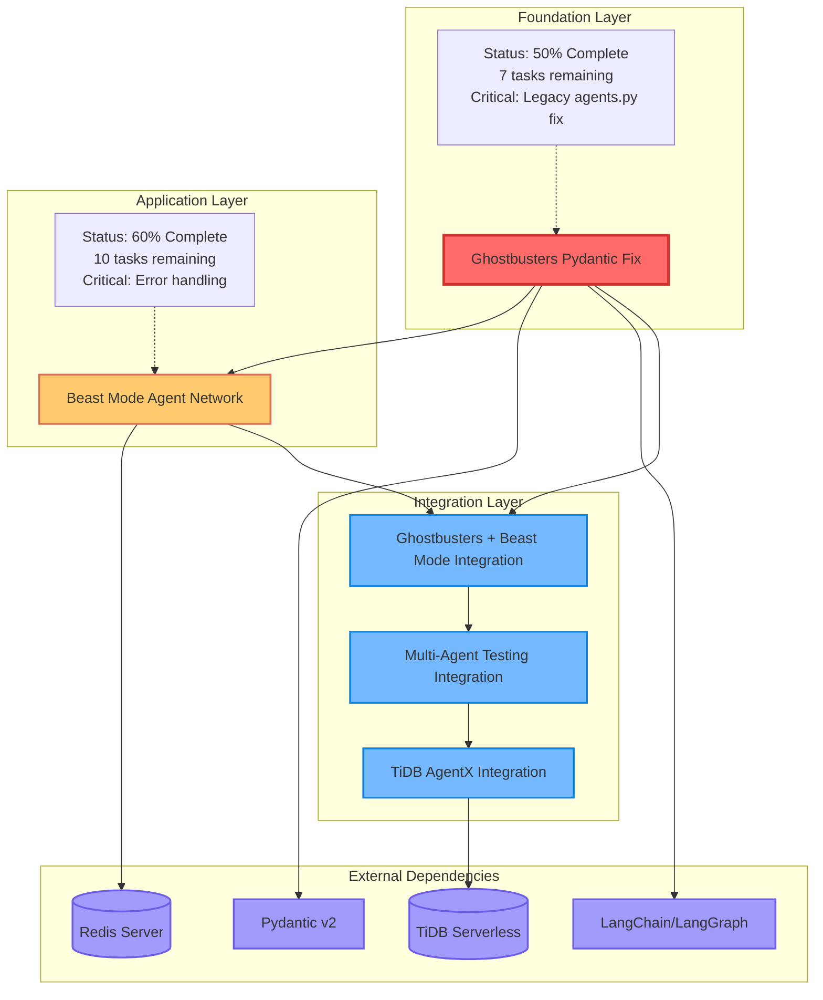
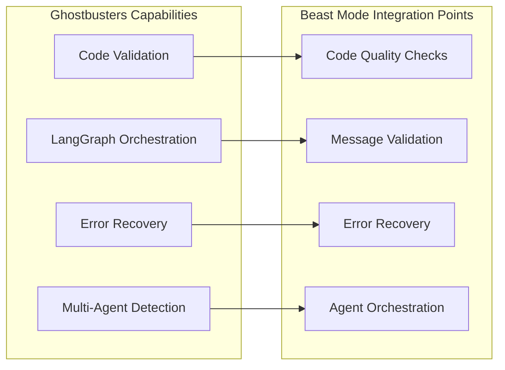
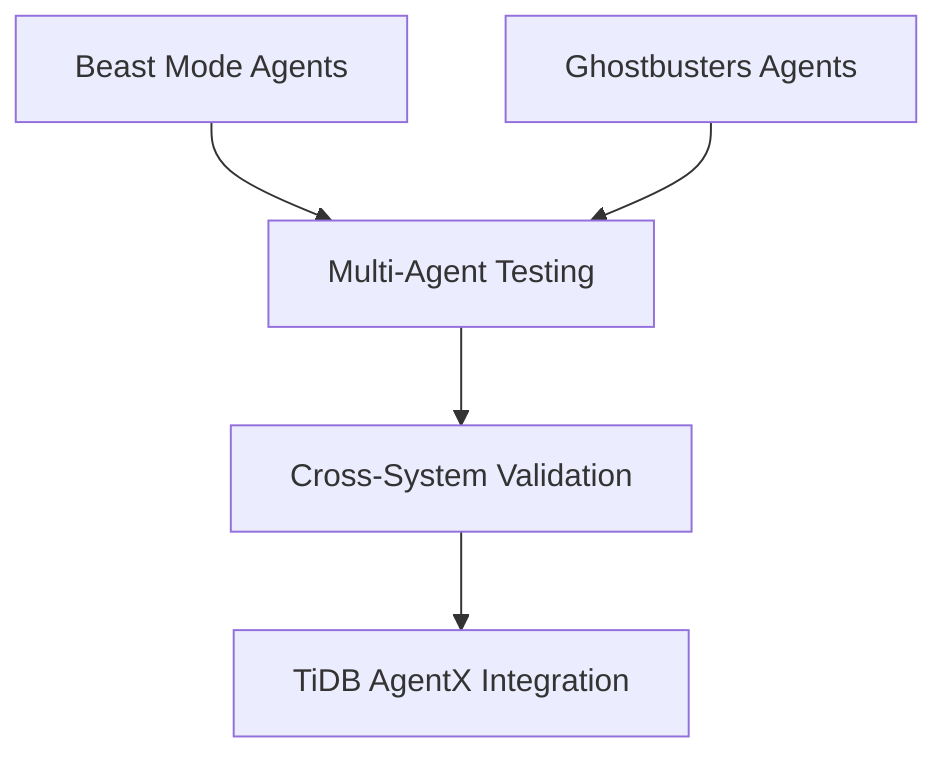
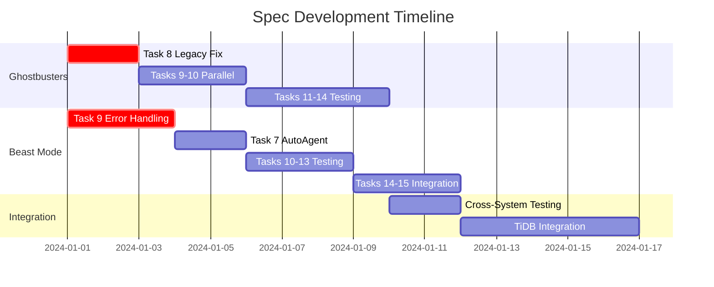

# Overall Spec DAG - Cross-Spec Dependencies Analysis

## Spec Relationship Overview

## Cross-Spec Dependency Analysis

### 1. Foundation Dependency: Ghostbusters → Beast Mode

**Dependency Type**: Technical Foundation
**Criticality**: HIGH
**Reason**: Beast Mode agents will likely use Ghostbusters for code quality validation

### 2. Shared Infrastructure Dependencies

**Redis Foundation**:
- Beast Mode: Core messaging infrastructure
- Ghostbusters: Potential multi-agent coordination
- Integration: Shared message bus for cross-system communication

**Pydantic v2**:
- Ghostbusters: Critical for LangChain compatibility
- Beast Mode: Message model validation
- Integration: Consistent data models across systems

### 3. Future Integration Opportunities

**Multi-Agent Testing Integration**:

## Critical Path Analysis

### Blocking Dependencies

1. **Ghostbusters Task 8** (Fix Legacy agents.py)
   - **Blocks**: All Ghostbusters testing and validation
   - **Impact**: Prevents Beast Mode quality integration
   - **Priority**: CRITICAL - Must complete first

2. **Beast Mode Task 9** (Error Handling)
   - **Blocks**: Reliable Beast Mode testing
   - **Impact**: System stability for integration
   - **Priority**: HIGH - Required for production use

### Parallel Development Opportunities

## Resource Allocation Strategy

### Phase 1: Foundation Stabilization (Week 1)
**Parallel Execution**:
- **Team A**: Ghostbusters Task 8 (Legacy agents.py fix)
- **Team B**: Beast Mode Task 9 (Error handling)

**Dependencies**: None - can run in parallel
**Risk**: High - both are critical path items

### Phase 2: Core Functionality (Week 2)
**Sequential Execution**:
- **Ghostbusters**: Tasks 9-10 (Validators & Recovery Engines)
- **Beast Mode**: Task 7 (AutoAgent Class)

**Dependencies**: Requires Phase 1 completion
**Risk**: Medium - well-defined scope

### Phase 3: Testing & Integration (Week 3-4)
**Parallel Testing**:
- **Ghostbusters**: Tasks 11-14 (Testing pipeline)
- **Beast Mode**: Tasks 10-15 (Testing & integration)

**Dependencies**: Requires Phase 2 completion
**Risk**: Low - testing can be parallelized

## Integration Readiness Matrix

| Component | Ghostbusters Ready | Beast Mode Ready | Integration Possible |
|-----------|-------------------|------------------|---------------------|
| **Data Models** | ❌ (Pydantic fix needed) | ✅ (Complete) | ❌ |
| **Error Handling** | ✅ (Complete) | ❌ (Task 9 pending) | ❌ |
| **Agent Framework** | ❌ (Legacy fix needed) | ✅ (Complete) | ❌ |
| **Testing Infrastructure** | ❌ (50% test success) | ❌ (Tests incomplete) | ❌ |
| **Message Bus** | ❌ (No Redis integration) | ✅ (Complete) | ❌ |

**Current Integration Readiness**: 0% - Both specs need completion
**Estimated Integration Readiness**: 3-4 weeks with parallel development

## Risk Assessment & Mitigation

### High Risk Dependencies

1. **Pydantic v2 Compatibility**
   - **Risk**: LangChain version conflicts
   - **Mitigation**: Pin compatible versions, test thoroughly
   - **Impact**: Blocks Ghostbusters entirely

2. **Redis Infrastructure**
   - **Risk**: Network reliability for Beast Mode
   - **Mitigation**: Robust error handling (Task 9)
   - **Impact**: Beast Mode system stability

### Medium Risk Dependencies

1. **Cross-System Message Format**
   - **Risk**: Incompatible message models
   - **Mitigation**: Shared pydantic models
   - **Impact**: Integration complexity

2. **Agent Lifecycle Management**
   - **Risk**: Conflicting agent management approaches
   - **Mitigation**: Standardized interfaces
   - **Impact**: System coordination

## Recommended Execution Strategy

### Immediate Actions (This Week)
1. **Start Ghostbusters Task 8** - Critical blocker removal
2. **Start Beast Mode Task 9** - Foundation stability
3. **Prepare integration planning** - Define shared interfaces

### Short Term (Next 2 Weeks)
1. **Complete core functionality** - Both specs to 80%+
2. **Begin integration testing** - Cross-system validation
3. **Document integration patterns** - Shared best practices

### Medium Term (Next Month)
1. **Full integration implementation** - Combined system
2. **TiDB AgentX integration** - Hackathon deliverable
3. **Performance optimization** - Production readiness

## Success Metrics

### Spec Completion Metrics
- **Ghostbusters**: >90% test success rate
- **Beast Mode**: All 15 tasks completed
- **Integration**: Cross-system message exchange working

### System Integration Metrics
- **Message Throughput**: >100 messages/second
- **Agent Discovery**: <1 second response time
- **Error Recovery**: <5 second recovery time
- **System Uptime**: >99% availability

This DAG analysis reveals that while the specs can be developed in parallel initially, true integration requires both to reach substantial completion. The critical path runs through Ghostbusters Task 8 and Beast Mode Task 9, making these the highest priority items for immediate execution.