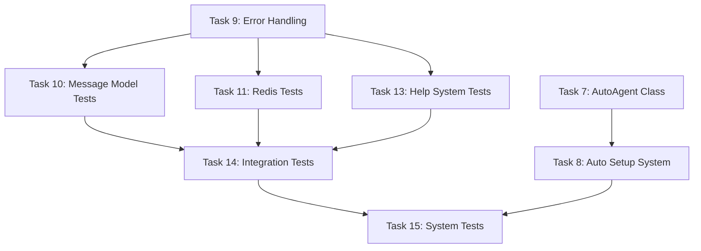
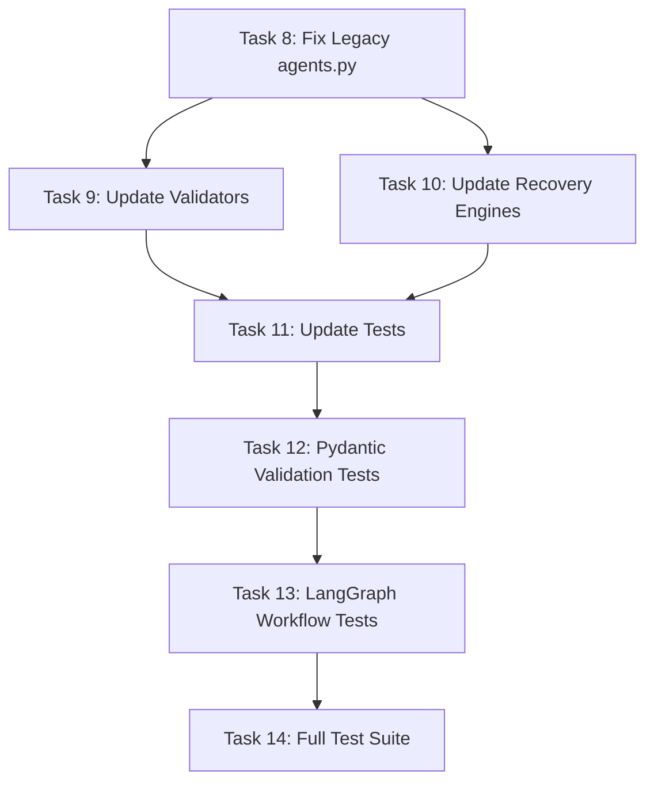

# Beast Mode Specs Task DAG Analysis

## Beast Mode Agent Network - Incomplete Tasks

### Task Dependencies (DAG Structure)

### Priority Analysis

**Critical Path (Blocking other tasks):**
1. **Task 9: Error Handling** - Foundational for all testing
2. **Task 7: AutoAgent Class** - Required for system demonstration
3. **Task 8: Auto Setup System** - Required for deployment

**Testing Path (Can be parallelized):**
- Task 10: Message Model Tests
- Task 11: Redis Tests  
- Task 13: Help System Tests
- Task 14: Integration Tests
- Task 15: System Tests

## Ghostbusters Pydantic Fix - Incomplete Tasks

### Task Dependencies (DAG Structure)

### Priority Analysis

**Critical Path:**
1. **Task 8: Fix Legacy agents.py** - Blocking all other tasks
2. **Task 9 & 10: Update Validators/Recovery Engines** - Can be done in parallel
3. **Task 11: Update Tests** - Depends on 9 & 10
4. **Task 12-14: Testing Pipeline** - Sequential validation

## Recommended Execution Order

### Beast Mode Agent Network
1. **Immediate**: Task 9 (Error Handling) - Unblocks testing
2. **Next**: Task 7 (AutoAgent Class) - Core functionality
3. **Parallel**: Tasks 10, 11, 13 (Unit Tests) - Can run simultaneously
4. **Sequential**: Task 8 → Task 14 → Task 15

### Ghostbusters Pydantic Fix  
1. **Immediate**: Task 8 (Fix Legacy agents.py) - Critical blocker
2. **Parallel**: Tasks 9 & 10 (Validators & Recovery Engines)
3. **Sequential**: Task 11 → Task 12 → Task 13 → Task 14

## Resource Allocation Suggestions

### High Priority (Start Immediately)
- Beast Mode Task 9: Error Handling
- Ghostbusters Task 8: Fix Legacy agents.py

### Medium Priority (Next Sprint)
- Beast Mode Task 7: AutoAgent Class
- Ghostbusters Tasks 9 & 10: Update Validators/Recovery Engines

### Low Priority (Testing Phase)
- All remaining testing tasks can be parallelized once dependencies are met

## Estimated Completion Timeline

### Beast Mode Agent Network
- **Week 1**: Tasks 9, 7 (Core functionality)
- **Week 2**: Tasks 10, 11, 13 (Parallel testing)
- **Week 3**: Tasks 8, 14, 15 (Integration & deployment)

### Ghostbusters Pydantic Fix
- **Week 1**: Task 8 (Critical fix)
- **Week 2**: Tasks 9, 10 (Parallel updates)
- **Week 3**: Tasks 11, 12, 13, 14 (Testing pipeline)

## Risk Assessment

### Beast Mode Agent Network
- **High Risk**: Task 9 (Error Handling) - Complex async error scenarios
- **Medium Risk**: Task 14 (Integration Tests) - Multi-agent coordination complexity
- **Low Risk**: Unit tests (Tasks 10, 11, 13) - Well-defined scope

### Ghostbusters Pydantic Fix
- **High Risk**: Task 8 (Legacy agents.py) - Potential breaking changes
- **Medium Risk**: Task 13 (LangGraph Tests) - Complex workflow testing
- **Low Risk**: Tasks 9, 10 (Validators/Recovery) - Straightforward migrations