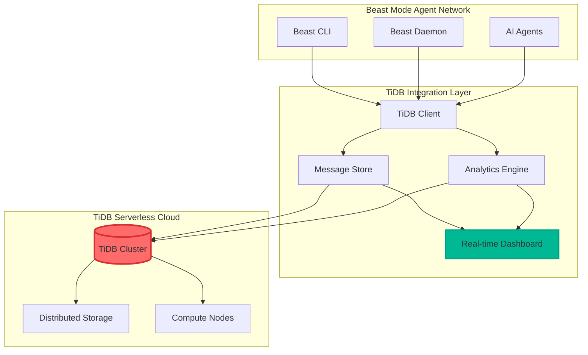
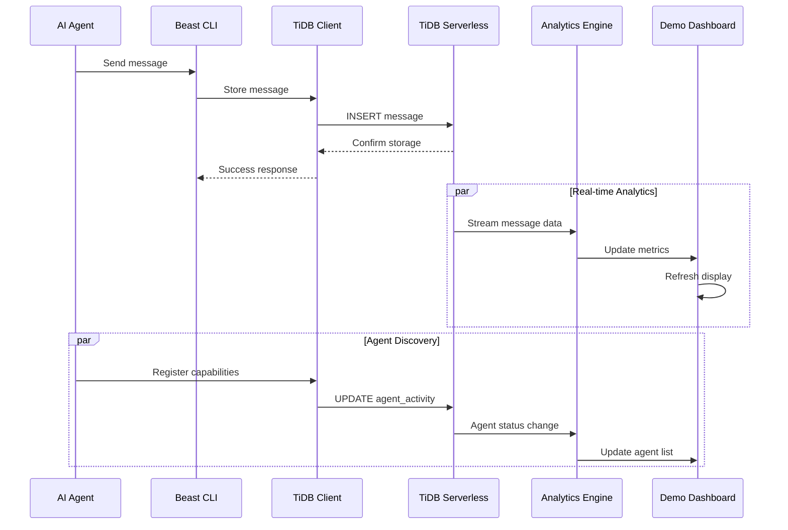

# TiDB Integration Design Document

## Overview

The TiDB Integration design transforms the Beast Mode Agent Network from a Redis-based messaging system to a TiDB Serverless-powered distributed agent coordination platform. This design prioritizes hackathon demo success while building a foundation for production scalability.

The integration leverages TiDB's HTAP (Hybrid Transactional/Analytical Processing) capabilities to provide real-time agent coordination with powerful analytics, showcasing why TiDB is superior to traditional message queues for multi-agent systems.

## Architecture

### High-Level System Architecture



### Data Flow Architecture



## Components and Interfaces

### 1. TiDB Client Layer

**Design Philosophy:** Seamless integration with existing Beast Mode Network while maximizing TiDB capabilities.

```python
class TiDBClient:
    """Primary interface for all TiDB operations."""
    
    def __init__(self, connection_string: str):
        self.engine = create_engine(connection_string)
        self.session_maker = sessionmaker(bind=self.engine)
        self.analytics = AnalyticsEngine(self.engine)
        
    async def store_message(self, message: BeastModeMessage) -> bool:
        """Store message with automatic analytics update."""
        
    async def get_messages(self, filters: MessageFilters) -> List[BeastModeMessage]:
        """Retrieve messages with advanced filtering."""
        
    async def get_agent_analytics(self) -> AgentAnalytics:
        """Real-time agent coordination analytics."""
        
    async def execute_demo_query(self, query_type: DemoQueryType) -> DemoResult:
        """Execute pre-built queries for hackathon demo."""
```

### 2. Message Storage Schema

**Optimized for both transactional messaging and analytical queries:**

```sql
-- Primary message storage with JSON payload
CREATE TABLE beast_messages (
    id VARCHAR(36) PRIMARY KEY,
    type VARCHAR(50) NOT NULL,
    source VARCHAR(100) NOT NULL,
    target VARCHAR(100),
    payload JSON NOT NULL,
    timestamp TIMESTAMP(6) NOT NULL DEFAULT CURRENT_TIMESTAMP(6),
    priority INT NOT NULL DEFAULT 5,
    correlation_id VARCHAR(36),
    
    -- Indexes for fast queries
    INDEX idx_timestamp (timestamp),
    INDEX idx_source_type (source, type),
    INDEX idx_target (target),
    INDEX idx_correlation (correlation_id)
) SHARD_ROW_ID_BITS = 4;

-- Agent activity tracking for analytics
CREATE TABLE agent_activity (
    agent_id VARCHAR(100) PRIMARY KEY,
    agent_name VARCHAR(200),
    capabilities JSON,
    last_seen TIMESTAMP(6) NOT NULL DEFAULT CURRENT_TIMESTAMP(6),
    message_count INT NOT NULL DEFAULT 0,
    help_requests_sent INT NOT NULL DEFAULT 0,
    help_requests_received INT NOT NULL DEFAULT 0,
    trust_score DECIMAL(3,2) DEFAULT 0.50,
    status ENUM('online', 'offline', 'busy') DEFAULT 'online',
    
    INDEX idx_last_seen (last_seen),
    INDEX idx_status (status),
    INDEX idx_trust_score (trust_score)
);

-- Message analytics materialized view for demo
CREATE VIEW message_analytics AS
SELECT 
    DATE(timestamp) as date,
    HOUR(timestamp) as hour,
    type,
    source,
    COUNT(*) as message_count,
    AVG(priority) as avg_priority
FROM beast_messages 
GROUP BY DATE(timestamp), HOUR(timestamp), type, source;

-- Agent collaboration network for graph analytics
CREATE TABLE agent_collaborations (
    id BIGINT AUTO_INCREMENT PRIMARY KEY,
    requester_id VARCHAR(100) NOT NULL,
    helper_id VARCHAR(100) NOT NULL,
    collaboration_type VARCHAR(50) NOT NULL,
    started_at TIMESTAMP(6) NOT NULL,
    completed_at TIMESTAMP(6),
    success BOOLEAN,
    
    INDEX idx_requester (requester_id),
    INDEX idx_helper (helper_id),
    INDEX idx_type_time (collaboration_type, started_at)
);
```

### 3. Analytics Engine

**Real-time analytics leveraging TiDB's HTAP capabilities:**

```python
class AnalyticsEngine:
    """Real-time analytics for hackathon demo."""
    
    def __init__(self, tidb_engine):
        self.engine = tidb_engine
        
    async def get_network_health(self) -> NetworkHealth:
        """Overall network health metrics."""
        query = """
        SELECT 
            COUNT(DISTINCT agent_id) as total_agents,
            COUNT(CASE WHEN last_seen > NOW() - INTERVAL 5 MINUTE THEN 1 END) as active_agents,
            SUM(message_count) as total_messages,
            AVG(trust_score) as avg_trust_score,
            MAX(last_seen) as last_activity
        FROM agent_activity
        """
        
    async def get_message_flow_analytics(self) -> MessageFlowAnalytics:
        """Message flow patterns for demo visualization."""
        query = """
        SELECT 
            source,
            target,
            type,
            COUNT(*) as message_count,
            AVG(priority) as avg_priority,
            MIN(timestamp) as first_message,
            MAX(timestamp) as last_message
        FROM beast_messages 
        WHERE timestamp > NOW() - INTERVAL 1 HOUR
        GROUP BY source, target, type
        ORDER BY message_count DESC
        """
        
    async def get_collaboration_network(self) -> CollaborationNetwork:
        """Agent collaboration patterns for graph visualization."""
        query = """
        SELECT 
            requester_id,
            helper_id,
            COUNT(*) as collaboration_count,
            AVG(CASE WHEN success THEN 1 ELSE 0 END) as success_rate,
            AVG(TIMESTAMPDIFF(SECOND, started_at, completed_at)) as avg_duration
        FROM agent_collaborations
        WHERE started_at > NOW() - INTERVAL 24 HOUR
        GROUP BY requester_id, helper_id
        HAVING collaboration_count > 0
        """
        
    async def get_real_time_metrics(self) -> RealTimeMetrics:
        """Live metrics for demo dashboard."""
        query = """
        SELECT 
            COUNT(*) as messages_last_minute,
            COUNT(DISTINCT source) as active_agents_last_minute,
            AVG(priority) as avg_priority_last_minute
        FROM beast_messages 
        WHERE timestamp > NOW() - INTERVAL 1 MINUTE
        """
```

### 4. Demo Dashboard

**Real-time visualization for hackathon presentation:**

```python
class DemoDashboard:
    """Interactive dashboard for hackathon demo."""
    
    def __init__(self, analytics_engine: AnalyticsEngine):
        self.analytics = analytics_engine
        self.update_interval = 2  # seconds
        
    async def render_network_overview(self) -> DashboardPanel:
        """Network health and activity overview."""
        
    async def render_message_flow(self) -> DashboardPanel:
        """Real-time message flow visualization."""
        
    async def render_agent_collaboration_graph(self) -> DashboardPanel:
        """Agent collaboration network graph."""
        
    async def render_tidb_performance_metrics(self) -> DashboardPanel:
        """TiDB performance showcase."""
        
    async def start_demo_mode(self):
        """Start real-time dashboard for demo."""
        while True:
            await self.refresh_all_panels()
            await asyncio.sleep(self.update_interval)
```

## Data Models

### Core Message Model Enhancement

```python
@dataclass
class TiDBBeastModeMessage:
    """Enhanced message model for TiDB storage."""
    
    # Core message fields
    id: str
    type: MessageType
    source: str
    target: Optional[str]
    payload: Dict[str, Any]
    timestamp: datetime
    priority: int
    correlation_id: Optional[str]
    
    # TiDB-specific enhancements
    storage_timestamp: Optional[datetime] = None
    analytics_processed: bool = False
    demo_featured: bool = False
    
    def to_tidb_record(self) -> Dict[str, Any]:
        """Convert to TiDB storage format."""
        return {
            'id': self.id,
            'type': self.type.value,
            'source': self.source,
            'target': self.target,
            'payload': json.dumps(self.payload),
            'timestamp': self.timestamp,
            'priority': self.priority,
            'correlation_id': self.correlation_id
        }
    
    @classmethod
    def from_tidb_record(cls, record: Dict[str, Any]) -> 'TiDBBeastModeMessage':
        """Create from TiDB query result."""
        return cls(
            id=record['id'],
            type=MessageType(record['type']),
            source=record['source'],
            target=record['target'],
            payload=json.loads(record['payload']),
            timestamp=record['timestamp'],
            priority=record['priority'],
            correlation_id=record['correlation_id'],
            storage_timestamp=record.get('storage_timestamp')
        )
```

### Agent Analytics Model

```python
@dataclass
class AgentAnalytics:
    """Comprehensive agent analytics for demo."""
    
    agent_id: str
    agent_name: str
    capabilities: List[str]
    
    # Activity metrics
    total_messages: int
    messages_last_hour: int
    messages_last_day: int
    
    # Collaboration metrics
    help_requests_sent: int
    help_requests_received: int
    help_success_rate: float
    
    # Network metrics
    trust_score: float
    collaboration_partners: List[str]
    network_centrality: float
    
    # Performance metrics
    avg_response_time: float
    uptime_percentage: float
    last_seen: datetime
    
    def to_demo_display(self) -> Dict[str, Any]:
        """Format for demo dashboard display."""
        return {
            'name': self.agent_name,
            'id': self.agent_id,
            'status': 'online' if self.is_active() else 'offline',
            'capabilities': self.capabilities,
            'activity_score': self.calculate_activity_score(),
            'collaboration_score': self.help_success_rate,
            'trust_level': self.trust_score,
            'network_influence': self.network_centrality
        }
    
    def is_active(self) -> bool:
        """Check if agent is currently active."""
        return (datetime.now() - self.last_seen).total_seconds() < 300
    
    def calculate_activity_score(self) -> float:
        """Calculate activity score for demo ranking."""
        return min(1.0, (self.messages_last_hour / 10.0))
```

## Integration Strategy

### Phase 1: Foundation Integration (Day 1-2)

**Goal:** Replace Redis with TiDB for message storage

```python
class BeastModeNetworkTiDBIntegration:
    """Main integration orchestrator."""
    
    def __init__(self):
        self.tidb_client = TiDBClient(os.getenv('TIDB_CONNECTION_STRING'))
        self.redis_client = None  # Deprecated
        self.analytics_engine = AnalyticsEngine(self.tidb_client.engine)
        
    async def migrate_from_redis(self):
        """One-time migration from Redis to TiDB."""
        # Export existing Redis data
        # Transform to TiDB format
        # Import to TiDB
        # Validate migration
        
    async def start_dual_mode(self):
        """Temporary dual-mode for safe transition."""
        # Write to both Redis and TiDB
        # Read from TiDB, fallback to Redis
        # Validate consistency
        
    async def complete_tidb_migration(self):
        """Complete migration to TiDB-only mode."""
        # Disable Redis writes
        # Switch to TiDB-only reads
        # Remove Redis dependencies
```

### Phase 2: Analytics Enhancement (Day 3-4)

**Goal:** Build compelling analytics for hackathon demo

```python
class HackathonDemoOrchestrator:
    """Orchestrates impressive demo scenarios."""
    
    def __init__(self, tidb_client: TiDBClient):
        self.tidb = tidb_client
        self.demo_scenarios = DemoScenarios()
        
    async def setup_demo_data(self):
        """Create realistic demo data."""
        # Generate sample agents
        # Create message flows
        # Simulate collaborations
        # Populate analytics
        
    async def run_live_demo_scenario(self, scenario: DemoScenario):
        """Execute live demo scenario."""
        # Start agent activities
        # Generate realistic message flows
        # Update analytics in real-time
        # Showcase TiDB capabilities
        
    async def demonstrate_tidb_advantages(self):
        """Show why TiDB is superior."""
        # Complex analytical queries
        # Real-time HTAP capabilities
        # Horizontal scaling demo
        # Performance comparisons
```

## Demo Scenarios

### Scenario 1: Multi-Agent Code Review

```python
async def demo_code_review_collaboration():
    """Demonstrate agents collaborating on code review."""
    
    # Agent 1: Submits code for review
    await submit_code_review_request(
        agent="developer_agent_1",
        code="complex_algorithm.py",
        expertise_needed=["python", "algorithms", "performance"]
    )
    
    # TiDB Analytics: Show agent discovery in real-time
    await display_agent_matching_analytics()
    
    # Agent 2: Security expert responds
    await respond_to_review(
        agent="security_expert_agent",
        findings=["potential_vulnerability", "input_validation_needed"]
    )
    
    # Agent 3: Performance expert responds  
    await respond_to_review(
        agent="performance_expert_agent",
        findings=["optimization_opportunities", "complexity_analysis"]
    )
    
    # TiDB Analytics: Show collaboration network forming
    await display_collaboration_network_growth()
    
    # Final integration and learning
    await complete_collaboration(
        improvements_implemented=True,
        knowledge_shared=True,
        trust_scores_updated=True
    )
    
    # TiDB Analytics: Show trust network evolution
    await display_trust_network_analytics()
```

### Scenario 2: Distributed Problem Solving

```python
async def demo_distributed_problem_solving():
    """Show agents coordinating to solve complex problems."""
    
    # Complex problem arrives
    await receive_complex_problem(
        problem="optimize_distributed_database_query",
        requires_expertise=["databases", "optimization", "distributed_systems"]
    )
    
    # TiDB Analytics: Show problem decomposition
    await display_problem_decomposition_analytics()
    
    # Multiple agents contribute solutions
    await parallel_solution_development()
    
    # TiDB Analytics: Show real-time collaboration metrics
    await display_real_time_collaboration_metrics()
    
    # Solution synthesis and validation
    await synthesize_and_validate_solution()
    
    # TiDB Analytics: Show outcome analytics
    await display_solution_quality_analytics()
```

## Performance Optimization

### TiDB-Specific Optimizations

```python
class TiDBPerformanceOptimizer:
    """Optimize TiDB usage for demo performance."""
    
    def __init__(self, tidb_client: TiDBClient):
        self.tidb = tidb_client
        
    async def optimize_for_demo(self):
        """Optimize TiDB configuration for demo."""
        
        # Connection pool optimization
        await self.optimize_connection_pool()
        
        # Query optimization
        await self.create_demo_indexes()
        
        # Caching strategy
        await self.setup_query_caching()
        
        # Monitoring setup
        await self.setup_performance_monitoring()
    
    async def create_demo_indexes(self):
        """Create indexes optimized for demo queries."""
        indexes = [
            "CREATE INDEX idx_demo_recent_messages ON beast_messages (timestamp DESC, type)",
            "CREATE INDEX idx_demo_agent_activity ON agent_activity (last_seen DESC, status)",
            "CREATE INDEX idx_demo_collaborations ON agent_collaborations (started_at DESC, success)"
        ]
        
        for index in indexes:
            await self.tidb.execute(index)
```

## Error Handling and Resilience

### Demo-Critical Error Handling

```python
class DemoResilienceManager:
    """Ensure demo never fails due to technical issues."""
    
    def __init__(self, tidb_client: TiDBClient):
        self.tidb = tidb_client
        self.fallback_data = DemoFallbackData()
        
    async def handle_tidb_connection_failure(self):
        """Handle TiDB connection issues during demo."""
        
        # Immediate fallback to cached data
        await self.switch_to_fallback_mode()
        
        # Attempt reconnection in background
        asyncio.create_task(self.attempt_reconnection())
        
        # Continue demo with cached analytics
        await self.continue_demo_with_cache()
    
    async def ensure_demo_data_availability(self):
        """Pre-load demo data to prevent failures."""
        
        # Cache critical demo queries
        await self.cache_demo_queries()
        
        # Pre-generate demo scenarios
        await self.prepare_demo_scenarios()
        
        # Validate all demo paths
        await self.validate_demo_paths()
```

## Success Metrics

### Technical Metrics

- **Message Storage Latency**: < 100ms for 95th percentile
- **Analytics Query Performance**: < 1 second for demo queries
- **Concurrent Agent Support**: 50+ agents without degradation
- **Demo Reliability**: 99.9% uptime during presentation

### Demo Impact Metrics

- **Judge Engagement**: Real-time analytics capture attention
- **Technical Differentiation**: Clear TiDB advantages demonstrated
- **Scalability Showcase**: Horizontal scaling capabilities evident
- **Innovation Factor**: Creative use of TiDB HTAP capabilities

## Conclusion

This design transforms the Beast Mode Agent Network into a TiDB-powered demonstration of next-generation distributed agent coordination. By leveraging TiDB's unique HTAP capabilities, we create a compelling hackathon submission that showcases both technical innovation and practical value.

The design prioritizes demo success while building a foundation for real-world scalability, ensuring our hackathon submission stands out from traditional message queue solutions and demonstrates the true power of TiDB Serverless for multi-agent systems.