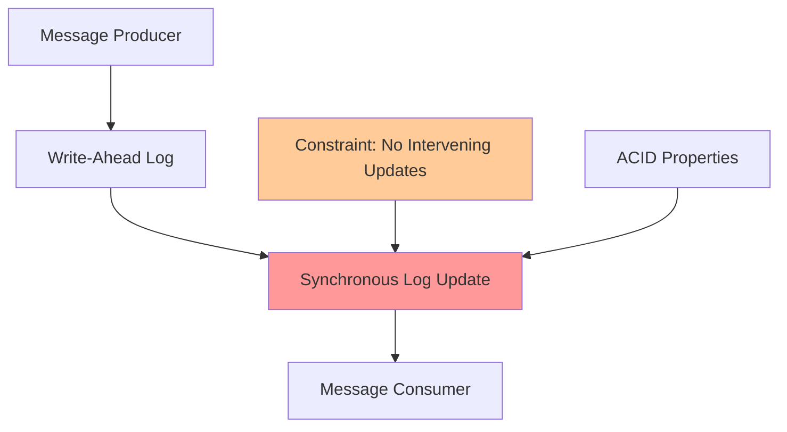
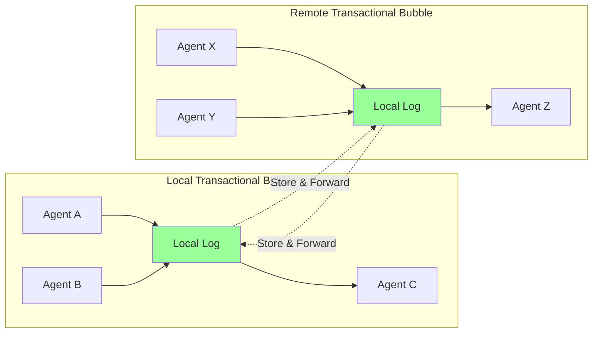
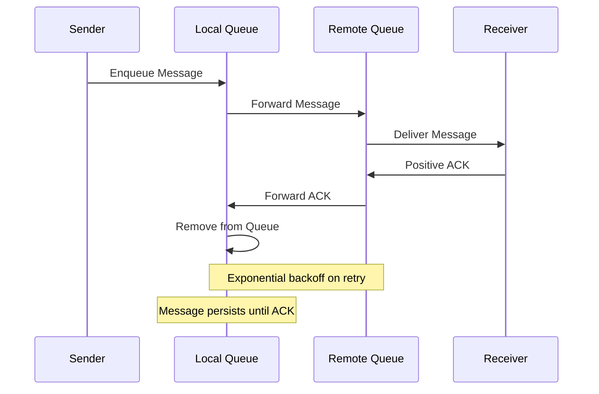
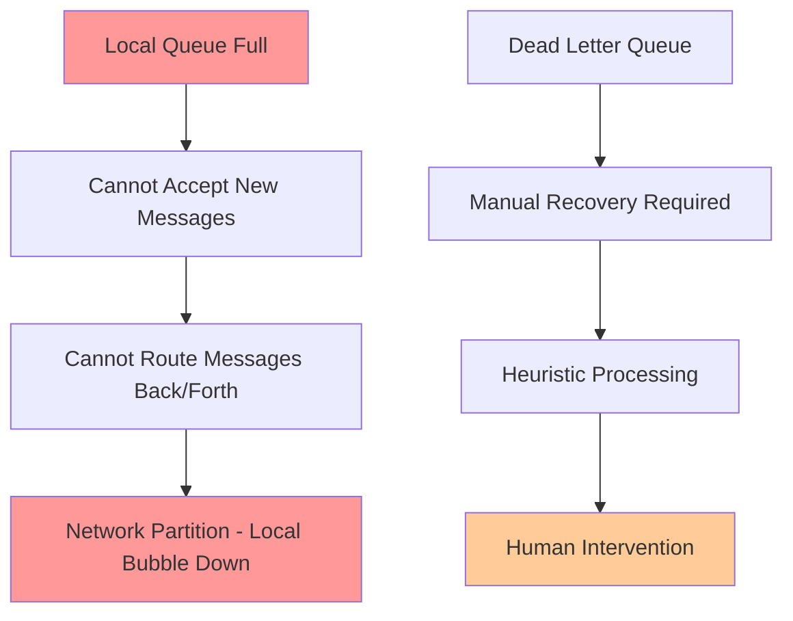
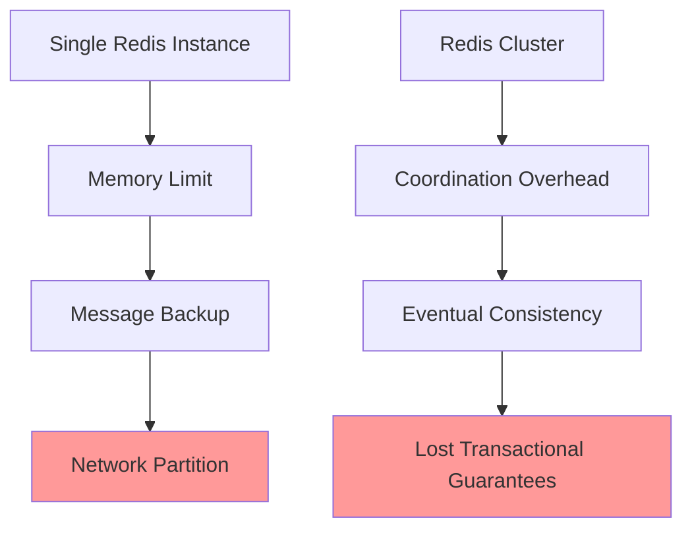
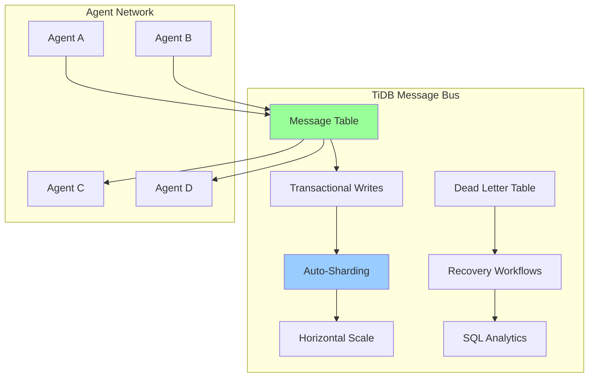

# Distributed Messaging Problem Analysis
## The Beast Mode Network Scaling Challenge

### Problem Statement

The Beast Mode Integrated Development Environment requires a messaging infrastructure that can coordinate agents across networks of arbitrary scale - from zero to massive distributed systems. The fundamental challenge is achieving reliable message delivery and coordination without sacrificing the transactional guarantees that make multi-agent systems predictable and debuggable.

### The Physics of Distributed Messaging

#### Transactional Messaging Fundamentals

All reliable messaging systems, whether "fire-and-forget" or "transactional", depend on the same underlying physics as transactional databases:

**Key Insight**: The synchronous log is what enables transactional processing. Without it, you enter two-phase commit territory with all its failure modes.

#### Local vs Distributed Constraints

**Constraint**: Transactional guarantees only work within a single log domain. Cross-domain requires store-and-forward patterns.

### Store-and-Forward Pattern Analysis

#### The Positive Acknowledgment Protocol

#### Failure Modes and Consequences

**Critical Failure**: When the local queue backs up, the entire network segment becomes unavailable for bidirectional communication.

### Current Redis-Based Limitations

#### Memory Constraints
- Redis will run out of memory or stop accepting messages
- No infinite space assumption holds in practice
- Queue backup cascades to network failure

#### Scaling Bottlenecks

### The TiDB Solution Hypothesis

#### Advantages of TiDB-Backed Messaging

1. **Infinite Storage**: Disk-based persistence vs memory constraints
2. **Horizontal Scaling**: Auto-sharding across nodes
3. **Transactional Guarantees**: ACID compliance at scale
4. **SQL Queryability**: Message analytics and debugging
5. **HTAP Capabilities**: Real-time processing with historical analysis

#### Implementation Patterns

### Alternative Implementation Strategies

The TiDB approach is one implementation of a broader pattern. Other viable approaches:

1. **Kafka + Transactional Outbox**: Event sourcing with guaranteed delivery
2. **PostgreSQL + LISTEN/NOTIFY**: SQL-based messaging with triggers
3. **Distributed Log Systems**: Apache Pulsar, EventStore
4. **Hybrid Approaches**: Local Redis + TiDB persistence layer

### Constraints and Trade-offs

#### Fundamental Physics Constraints
- **CAP Theorem**: Cannot have consistency, availability, and partition tolerance simultaneously
- **Two-Phase Commit**: Requires heuristic processing for some failure modes
- **Store-and-Forward**: Requires infinite storage assumption or graceful degradation

#### Implementation Constraints
- **Latency vs Consistency**: Synchronous logs add latency
- **Storage vs Memory**: Disk persistence vs in-memory speed
- **Complexity vs Reliability**: Simple systems fail in predictable ways

### Success Criteria for Beast Mode Network

1. **Zero-to-Scale**: Must work from single developer to massive distributed teams
2. **Transactional Coordination**: Multi-agent workflows must be atomic
3. **Failure Recovery**: Dead letter queues and manual recovery workflows
4. **Observability**: Full message tracing and analytics
5. **Developer Experience**: Simple APIs that hide complexity

### Next Steps

This analysis suggests we need to:

1. **Prototype TiDB Message Bus**: Validate transactional messaging at scale
2. **Design Failure Recovery**: Dead letter queue processing workflows  
3. **Benchmark Performance**: Compare Redis vs TiDB latency/throughput
4. **Define APIs**: Abstract interface supporting multiple implementations
5. **Build Observability**: Message tracing and network health monitoring

The physics are unavoidable, but the implementation choices determine whether we get a system that scales gracefully or fails catastrophically under load.