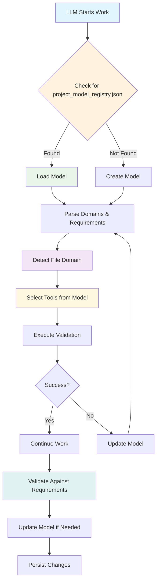
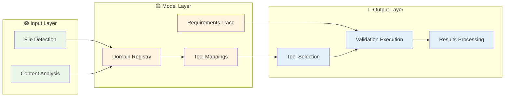

# 🧠 PR #5: Model Persistence & Self-Recovery System

## 📋 Overview

**Problem**: The `ProjectModel` orchestration layer existed only in Python code, making it impossible for future LLMs to recover the system's intent and continue work intelligently.

**Solution**: Created a persistent, machine-readable model registry and self-referential recovery system that enables any future LLM to understand and extend the system.

## 🎯 Key Changes

### 1. **`project_model_registry.json`** - The Single Source of Truth
```json
{
  "description": "Model-driven tool orchestration registry for OpenFlow Playground",
  "domains": {
    "cloudformation": {
      "patterns": ["*.template.yaml", "models/*.yaml"],
      "content_indicators": ["!Sub", "!Ref", "!GetAtt"],
      "linter": "cfn-lint",
      "requirements": ["Don't lint CloudFormation with generic YAML tools"]
    }
    // ... 4 more domains with full configurations
  },
  "requirements_traceability": [
    // Links every requirement to implementation and test
  ]
}
```

### 2. **`.cursor/rules/model-driven-orchestration.mdc`** - Self-Recovery Rule
```markdown
# Model-Driven Tool Orchestration

## ALWAYS Check for project_model_registry.json First

### When Starting Work:
1. **Look for `project_model_registry.json`** - This is the single source of truth
2. **Load and parse the model** - Understand the domain registry and requirements
3. **Use the model for tool selection** - Don't guess, use the explicit mappings
4. **Validate against requirements** - Check that your work traces to the model
```

## 🔄 Self-Recovery System

### **The Recovery Chain:**
1. **Cursor rule** → Tells LLM to check for `project_model_registry.json`
2. **JSON model** → Contains all domain mappings and requirements  
3. **Tests** → Prove the model works and trace requirements
4. **Rules** → Enforce the model-driven approach

### **Recovery Scenarios:**
- **If Lost**: Read the model, check requirements, run tests, follow mappings
- **If Tools Failing**: Check domain detection, verify tools, check exclusions
- **If Requirements Unclear**: Read requirements, check tests, follow traceability

## 🧪 What This Enables

### **For Future LLMs:**
- **Instant context recovery** - Load the model and understand the system
- **Intelligent tool selection** - Use explicit mappings, not guessing
- **Requirements traceability** - See how every piece connects
- **Self-healing** - Model can be updated when tools or requirements change

### **For Humans:**
- **Clear system documentation** - The model IS the documentation
- **Disaster recovery** - Any LLM can pick up where another left off
- **Extensibility** - Easy to add new domains or tools
- **Validation** - Tests prove the model works

## 📊 Model Contents

### **Domains Supported:**
- **CloudFormation** → `cfn-lint` (not generic YAML tools)
- **Python** → `flake8` + `black`
- **YAML** → `yamllint` (excluding CloudFormation)
- **Security** → `bandit` + `detect-secrets`
- **Bash** → `shellcheck`

### **Requirements Traceability:**
- 7 core requirements mapped to implementation and tests
- Each requirement has explicit domain, implementation, and test
- Full traceability from intent to code

### **Tool Selection Logic:**
- Pattern matching (40% weight)
- Content indicators (30% weight) 
- Exclusion handling (30% weight)
- Confidence threshold (50%)

## 🎨 Interactive Demo

```javascript
// Model Loading Demo
const loadModel = async () => {
  const model = await fetch('project_model_registry.json').then(r => r.json());
  
  console.log('📋 Domains:', Object.keys(model.domains));
  console.log('🔧 Tools:', model.domains.cloudformation.linter);
  console.log('📝 Requirements:', model.requirements_traceability.length);
  
  return model;
};

// Domain Detection Demo
const detectDomain = (filepath, model) => {
  for (const [domain, config] of Object.entries(model.domains)) {
    if (config.patterns.some(pattern => filepath.match(pattern))) {
      return { domain, tools: [config.linter, config.validator].filter(Boolean) };
    }
  }
  return { domain: 'unknown', tools: [] };
};
```

## 🔗 Related PRs

- **PR #1**: Security Cleanup (removed hardcoded credentials)
- **PR #2**: Automated Security Checks (pre-commit hooks)
- **PR #3**: Model-Driven Tool Orchestration (Python implementation)
- **PR #4**: Cursor Rules (7 new .mdc rules)

## 🚀 Impact

### **Before:**
- Model existed only in Python code
- No way for future LLMs to recover context
- Tool selection was guesswork
- Requirements were implicit

### **After:**
- **Persistent model** in machine-readable JSON
- **Self-recovery system** via Cursor rule
- **Explicit tool mappings** for each domain
- **Full requirements traceability** with tests

## 🎯 The Meta-Rule

**"The model is the authority. If you're not using `project_model_registry.json` to make decisions, you're guessing. Load the model, understand the intent, follow the mappings."**

---

## 📈 Mermaid: Model-Driven Architecture



## 🎨 Color-Coded Architecture



---

**🎉 This PR creates a self-healing, model-driven system that can recover from any state and continue intelligent work!** 