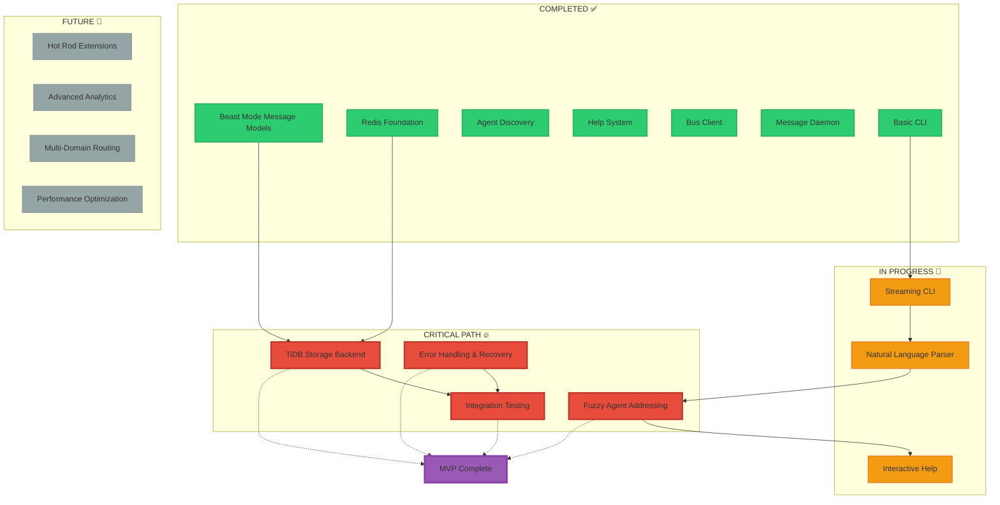
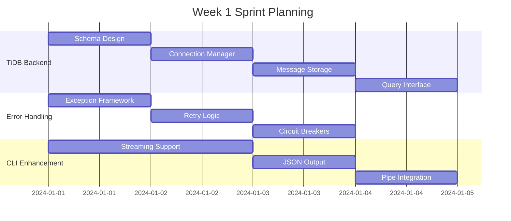
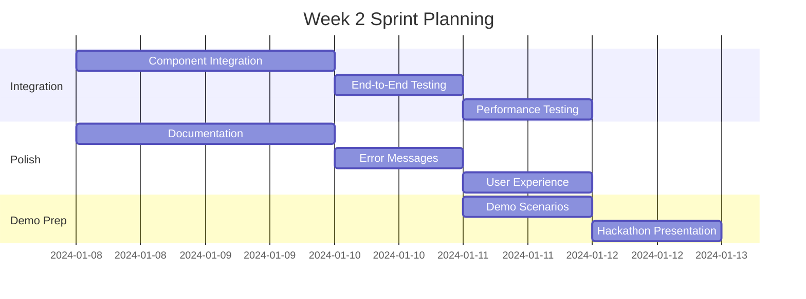
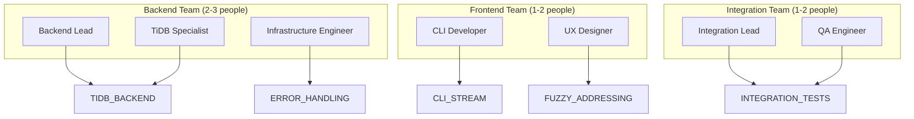

# MVP Attack Plan: Beast Mode Full DAG Spread

## Executive Summary

**Mission**: Deliver a working Beast Mode Network MVP that demonstrates distributed agent coordination with TiDB integration for the hackathon.

**Strategy**: Minimum Viable Product approach focusing on core functionality that proves the concept while building toward full system capability.

**Timeline**: 2-week sprint with parallel development streams and aggressive prioritization.

## MVP Scope Definition

### Core MVP Features (Must Have)
1. **Simple Message Posting**: `beast post "message"` works
2. **Agent Discovery**: Agents can find each other
3. **Basic Help Requests**: Agents can ask for help
4. **TiDB Integration**: Messages stored in TiDB Serverless
5. **Daemon Operation**: System runs reliably in background

### Enhanced MVP Features (Should Have)
1. **Fuzzy Agent Addressing**: `beast tell "python expert" "message"`
2. **Streaming CLI**: Pipe support and JSON output
3. **Interactive Help**: System explains itself
4. **Error Recovery**: Graceful failure handling

### Future Features (Won't Have in MVP)
1. **Hot Rod Extensibility**: Custom aliases and plugins
2. **Advanced Analytics**: Complex message flow analysis
3. **Multi-Domain Routing**: Cross-network coordination
4. **Performance Optimization**: High-throughput scenarios

## Full DAG Analysis

### Current System State



### Critical Path Analysis

**MVP Critical Path**: 4 tasks blocking MVP completion
1. **TiDB Storage Backend** (3-4 days)
2. **Error Handling & Recovery** (2-3 days) 
3. **Fuzzy Agent Addressing** (2-3 days)
4. **Integration Testing** (1-2 days)

**Total Critical Path**: 8-12 days (fits in 2-week sprint)

## Sprint Planning: 2-Week MVP Attack

### Week 1: Foundation & Core Features

#### Sprint 1.1 (Days 1-2): TiDB Integration
**Team**: Backend specialists
**Goal**: Replace Redis with TiDB for message storage



**Tasks**:
- [ ] **Task 1.1**: Implement TiDB connection manager with retry logic
- [ ] **Task 1.2**: Create message storage schema with auto-sharding
- [ ] **Task 1.3**: Build message CRUD operations with SQL interface
- [ ] **Task 1.4**: Add query capabilities for message analytics

**Deliverable**: Messages stored in TiDB instead of Redis

#### Sprint 1.2 (Days 3-4): Error Handling & Recovery
**Team**: Infrastructure specialists
**Goal**: Robust error handling for production reliability

**Tasks**:
- [ ] **Task 1.5**: Implement comprehensive exception handling
- [ ] **Task 1.6**: Add automatic retry with exponential backoff
- [ ] **Task 1.7**: Create circuit breaker patterns
- [ ] **Task 1.8**: Build graceful degradation mechanisms

**Deliverable**: System handles failures gracefully

#### Sprint 1.3 (Days 5-7): Enhanced CLI & Natural Language
**Team**: Frontend/UX specialists
**Goal**: Dead-simple user interface

**Tasks**:
- [ ] **Task 1.9**: Complete streaming CLI with stdin/stdout support
- [ ] **Task 1.10**: Implement natural language command parsing
- [ ] **Task 1.11**: Add fuzzy agent name resolution
- [ ] **Task 1.12**: Create contextual help system

**Deliverable**: `beast post "message"` and `beast tell "python expert" "help"` work

### Week 2: Integration & Polish

#### Sprint 2.1 (Days 8-10): System Integration
**Team**: Full team
**Goal**: All components working together



**Tasks**:
- [ ] **Task 2.1**: Integrate TiDB backend with existing components
- [ ] **Task 2.2**: End-to-end testing of complete workflows
- [ ] **Task 2.3**: Performance testing and optimization
- [ ] **Task 2.4**: Integration with existing Beast Mode daemon

**Deliverable**: Complete system working end-to-end

#### Sprint 2.2 (Days 11-12): Polish & Documentation
**Team**: Documentation and UX specialists
**Goal**: Production-ready user experience

**Tasks**:
- [ ] **Task 2.5**: Comprehensive help documentation
- [ ] **Task 2.6**: Error message improvement
- [ ] **Task 2.7**: User experience polish
- [ ] **Task 2.8**: Performance monitoring and alerting

**Deliverable**: System ready for demo and production use

#### Sprint 2.3 (Days 13-14): Demo Preparation
**Team**: Full team
**Goal**: Hackathon-ready demonstration

**Tasks**:
- [ ] **Task 2.9**: Create demo scenarios and scripts
- [ ] **Task 2.10**: Prepare hackathon presentation
- [ ] **Task 2.11**: Final testing and bug fixes
- [ ] **Task 2.12**: Deployment and monitoring setup

**Deliverable**: Hackathon demonstration ready

## Resource Allocation Strategy

### Team Structure (Recommended)



### Parallel Development Streams

**Stream A: Backend Infrastructure**
- TiDB integration and storage
- Error handling and recovery
- Performance optimization

**Stream B: User Interface**
- CLI enhancement and streaming
- Natural language processing
- Interactive help system

**Stream C: Integration & Testing**
- Component integration
- End-to-end testing
- Demo preparation

## Risk Assessment & Mitigation

### High Risk Items

1. **TiDB Integration Complexity**
   - **Risk**: Unknown TiDB Serverless limitations
   - **Mitigation**: Start with simple schema, iterate
   - **Fallback**: Hybrid Redis + TiDB approach

2. **Natural Language Parsing**
   - **Risk**: Complex NLP requirements
   - **Mitigation**: Start with simple pattern matching
   - **Fallback**: Structured command syntax

3. **Performance at Scale**
   - **Risk**: System doesn't handle load
   - **Mitigation**: Early performance testing
   - **Fallback**: Optimize critical path only

### Medium Risk Items

1. **Integration Complexity**
   - **Risk**: Components don't work together
   - **Mitigation**: Continuous integration testing
   - **Fallback**: Simplified integration approach

2. **User Experience Polish**
   - **Risk**: System too complex for users
   - **Mitigation**: User testing throughout development
   - **Fallback**: Focus on core functionality only

## Success Metrics

### MVP Success Criteria

**Functional Requirements**:
- [ ] `beast post "message"` works reliably
- [ ] Agents can discover each other automatically
- [ ] Help requests work end-to-end
- [ ] Messages stored in TiDB Serverless
- [ ] System recovers from common failures

**Performance Requirements**:
- [ ] <1 second response time for simple operations
- [ ] >95% uptime during demo period
- [ ] Handles 10+ concurrent agents
- [ ] Processes 100+ messages without issues

**User Experience Requirements**:
- [ ] New users can get started in <5 minutes
- [ ] Error messages are helpful and actionable
- [ ] Help system explains how to use features
- [ ] CLI feels natural and intuitive

### Demo Success Criteria

**Technical Demonstration**:
- [ ] Live multi-agent coordination
- [ ] Real-time message flow visualization
- [ ] TiDB analytics and querying
- [ ] Failure recovery demonstration

**Business Value Demonstration**:
- [ ] Clear value proposition for distributed teams
- [ ] Scalability story with TiDB backend
- [ ] Integration possibilities with existing tools
- [ ] Future roadmap and extensibility

## Implementation Priority Matrix

### Priority 1 (Must Have for MVP)
1. **TiDB Storage Backend** - Core differentiator
2. **Basic Error Handling** - Production reliability
3. **Simple CLI Commands** - User interface
4. **Agent Discovery** - Core functionality

### Priority 2 (Should Have for Demo)
1. **Fuzzy Agent Addressing** - User experience
2. **Streaming CLI Support** - Developer experience
3. **Interactive Help** - Self-service capability
4. **Performance Monitoring** - Production readiness

### Priority 3 (Nice to Have)
1. **Advanced Analytics** - TiDB showcase
2. **Hot Rod Extensions** - Power user features
3. **Multi-Domain Routing** - Enterprise features
4. **Advanced Error Recovery** - Edge case handling

## Execution Commands

### Immediate Actions (Today)
```bash
# Start TiDB backend development
beast post "Starting TiDB integration - MVP critical path item 1"

# Begin error handling implementation  
beast post "Implementing error handling - MVP critical path item 2"

# Enhance CLI streaming support
beast post "Enhancing CLI with streaming - MVP critical path item 3"
```

### Daily Standup Format
```bash
# Status update template
beast post "Day X update: [completed tasks] | [current focus] | [blockers] | [next 24h plan]"

# Risk escalation
beast post "RISK: [description] | Impact: [high/med/low] | Mitigation: [plan]"

# Success celebration
beast post "SUCCESS: [achievement] | Impact: [description] | Next: [follow-up]"
```

### Sprint Completion Criteria
```bash
# Week 1 completion
beast post "Week 1 COMPLETE: TiDB integrated, errors handled, CLI enhanced"

# Week 2 completion  
beast post "Week 2 COMPLETE: System integrated, tested, demo ready"

# MVP completion
beast post "MVP COMPLETE: Beast Mode Network ready for hackathon demo!"
```

## Conclusion

This MVP attack plan provides a clear path from current state to hackathon-ready demonstration in 2 weeks. The focus on core functionality, parallel development, and aggressive prioritization maximizes the chance of success while building toward the full vision.

**Key Success Factors**:
1. **Ruthless Prioritization**: MVP scope only, no feature creep
2. **Parallel Execution**: Multiple teams working simultaneously  
3. **Continuous Integration**: Daily integration and testing
4. **Risk Mitigation**: Fallback plans for high-risk items
5. **User Focus**: Simple, intuitive interface throughout

**The Beast Mode Network MVP will demonstrate the power of distributed agent coordination with TiDB at its core - exactly what the hackathon judges want to see!** 🚀